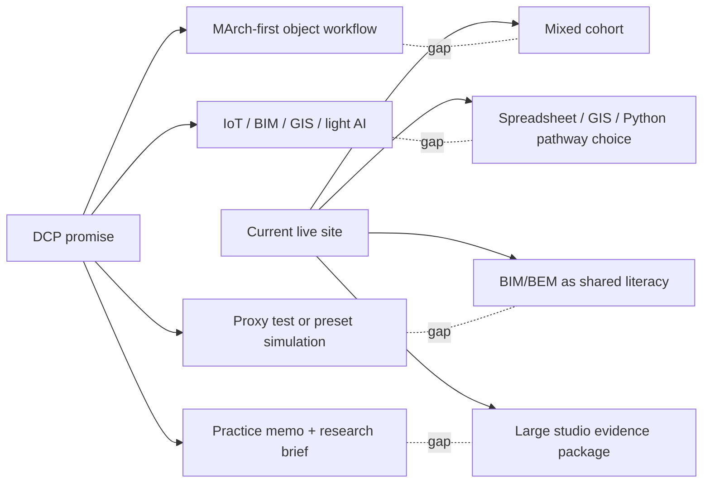
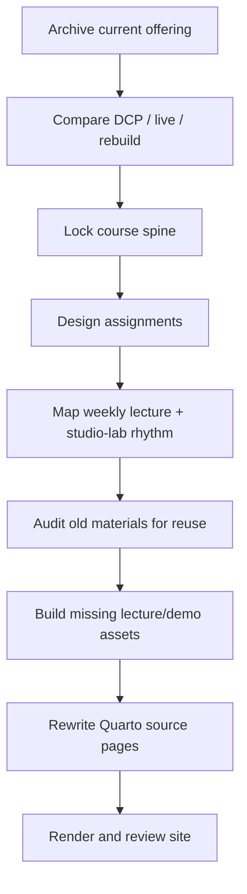

# ARCH7476 Rebuild Control Room

Working name: **Generative Design in Architecture: Studio Evidence Workflows**

This folder is the rebuild workspace. It is intentionally separate from the live Quarto course pages so the old offering remains intact while the new offering is designed.

## Archive Status

The current 2025-26 offering has been snapshotted here:

`archive/2025-26-current-offering-source/`

The archive includes:

- current root Quarto pages
- assignments
- weekly slides
- lecture files
- notebooks
- assets and course PDFs
- generated `docs/` site
- scripts and data

The rebuild should not overwrite or delete existing lecture work. Material should be migrated, reframed, or marked as archived.

## Rebuild Diagnosis

The old live site was coherent as an evidence-literacy course, but it did not fully match the DCP/course promise for MArch students.

Core mismatch:

## Rebuild Target

The new course should be MArch-first while still accessible to undergraduates.

One-sentence course spine:

> Students take one past or current studio decision, expose the evidence behind it, then rebuild that decision through a concrete generative/evidence workflow.

Working definition:

> Generative = a documented workflow that creates or varies multiple design options and evaluates them against explicit criteria.

## Non-Negotiable Design Rules

1. **Studio project as case study**
   Every class must ask students to work on their own studio project or prior studio project.

2. **A1 is retrospective**
   The semester opens with Total Recall: students reconstruct the evidence logic behind one past studio decision.

3. **A4 can branch**
   Students may complete A4 as either a retrospective redesign or a live current-studio application.

4. **2x50 structure**
   The first 50 minutes deliver a focused lecture/demo. The second 50 minutes are studio-lab application, desk crits, peer pairs, or selected share-outs.

5. **Tooling must become visible early**
   BIM/BEM, GH, simulation, GIS, Python, and AI-assisted workflow building should be introduced as different ways of translating a design decision into evidence.

6. **No lecture content loss**
   Existing lectures are archived and reused when they still serve the rebuilt spine.

7. **Every lab has latch-on questions**
   Students must never be left with only "work on your project." Each lab needs prompts, fallback tasks, and share-out formats.

## Proposed Rebuild Files

| File | Purpose |
|---|---|
| `01_offering-comparison.md` | DCP vs current live site vs rebuilt course |
| `02_weekly-course-blueprint.md` | week-by-week lecture/lab plan with prompts |
| `03_assignment-architecture.md` | A1-A4 structure, A4 branches, rubrics |
| `04_materials-gap-log.md` | what exists, what can be reused, what must be built |
| `08_logic_and_visual_walkthrough.md` | week-by-week logic audit and minimal slide/visual fill plan |
| `09_session2_assignment_integration.md` | recurring Session 2 round-table protocol mapped to A1-A4 components |

## Rebuild Process

## Immediate Next Actions

1. Confirm the course spine and A4 branching model.
2. Choose which workflow tracks are officially supported.
3. Decide which weeks need live demos versus lecture-only examples.
4. Build missing GH / simulation / AI-assisted workflow materials before rewriting the public site.
5. After materials are ready, update `index.qmd`, `schedule.qmd`, `assignments.qmd`, and individual assignment pages.

## Launch Gate

The public course should not be treated as ready for student release until these demo kits are runnable:

1. GH/parametric route starter kit.
2. Week 5 proxy or preset simulation kit.
3. Week 8 AI-assisted workflow verification kit.

Until those kits exist, the rebuild is a strong course design but not yet a deliverable generative design course.
