# Weekly Course Blueprint

Default class rhythm:

| Block | Time | Function |
|---|---:|---|
| Opening frame | 5-10 min | weekly question and connection to A1/A4 |
| Lecture/demo | 30-35 min | focused concept, tool, or worked example |
| Transition prompt | 5 min | convert lecture into student project task |
| Studio-lab | 45-50 min | project work, desk crits, peer pairs, selected share-outs |

The second block is not generic work time. Each week has prompts, fallback tasks, and a share-out format.

## Semester Map

```mermaid
flowchart LR
    W1[Total Recall] --> W2[Tool Translation]
    W2 --> W3[Parametric Variables]
    W3 --> W4[Evidence + Ranges]
    W4 --> W5[Test / Simulation]
    W5 --> W6[Branch Declaration]
    W6 --> W7[Prototype Clinic]
    W7 --> W8[AI + Documentation]
    W8 --> W9[Thresholds]
    W9 --> W10[Draft Review]
    W10 --> W11[Package Polish]
    W11 --> W12[Object Fair]
```

## Week 1: Total Recall

**Lecture/demo focus**

- What counts as evidence in studio?
- How design decisions get justified after the fact.
- Difference between precedent, evidence, assumption, taste, tutor pressure, and workflow output.

**Studio-lab task**

Students build a one-page Total Recall board from a prior studio project.

**Latch-on questions**

- What was one design decision you made?
- What alternatives existed at the time?
- What evidence did you claim, imply, or rely on?
- Which input actually carried the argument?
- What was intuition or precedent rather than evidence?
- What evidence would have changed the decision?
- What variable, range, or threshold was missing?

**Share-out format**

3-minute case board:

1. decision
2. original evidence
3. weakest link
4. workflow you wish you had

**Materials status**

Partly exists. Current A1 and Week 1 can be reused, but the first-class case board template should be built.

## Week 2: Tool Translation, BIM/BEM, and Design Evidence

**Lecture/demo focus**

- BIM, BEM, GH, GIS, Python, and AI each translate design into different evidence structures.
- Move BIM vs BEM earlier.
- Show why models are not neutral.

**Studio-lab task**

Students map their chosen design decision into possible tool translations.

**Latch-on questions**

- If this decision entered BIM, what would be represented?
- If it entered BEM, what would be simplified or assumed?
- If it entered GH, what parameters could vary?
- If it entered GIS, what spatial layers would matter?
- If it entered Python, what repeated analysis or visualization would become possible?
- If AI helped build the workflow, what would still need verification?

**Share-out format**

Tool translation matrix: one decision, three possible tool translations, one chosen first route.

**Materials status**

Partly exists. Week 5 BIM/BEM deck should move here, but it needs a new opening frame connecting BIM/BEM to GH/GIS/Python/AI.

## Week 3: Parametric Design Logic and GH Workflow Scaffolds

**Lecture/demo focus**

- What makes a design decision parametric?
- Variables, constraints, objectives, outputs.
- GH workflow anatomy: input sliders, geometry operation, analysis output, export.
- AI-assisted GH/Python scripting as support, not proof.

**Studio-lab task**

Students identify 2-4 variables in their studio decision and sketch a possible GH or low-code workflow.

**Latch-on questions**

- What can vary without destroying the design intent?
- Which parameter is a design choice rather than a drawing convenience?
- Which output would tell you whether one variant is better?
- What would be a reasonable range for the parameter?
- What geometry or data must be exported for comparison?
- What part could AI help generate, and what must you verify?

**Share-out format**

Variable board: inputs, range, output, intended decision.

**Materials status**

Gap. Need GH starter definitions, screenshots, and a 10-minute live demo.

## Week 4: Evidence Map, Ranges, and Data Sources

**Lecture/demo focus**

- Evidence tiers.
- Source quality.
- Ranges and sensitivity.
- How to convert design claims into measurable or comparable properties.

**Studio-lab task**

Students build an evidence map for their chosen decision.

**Latch-on questions**

- What is already known?
- What is locally specific?
- What can be measured, simulated, inferred, or only argued?
- Which values need ranges rather than point estimates?
- Which evidence source is strongest?
- Which source is merely convenient?
- What would make the workflow fail?

**Share-out format**

Evidence map with one "must-have" source and one weak source named.

**Materials status**

Mostly exists. Current A2 and spreadsheet evidence tables can be reused.

## Week 5: Proxy Test or Preset Simulation

**Lecture/demo focus**

- Small tests, preset simulations, and right-sized claims.
- Radiance/VELUX/EnergyPlus Simple Glazing examples if available.
- Testability rule: test the physics or logic behind a claim when real data is inaccessible.

**Studio-lab task**

Students write a mini test plan and select a proxy test or preset simulation route.

**Latch-on questions**

- What exact claim can be tested?
- What is the smallest test that would reduce uncertainty?
- What inputs must be fixed?
- What inputs should vary?
- What counts as a useful result?
- What would make the test invalid?
- What output can be shown in A4?

**Share-out format**

Plain-language pre-registration: question, variable, metric, stop/fail rule.

**Materials status**

Gap. DCP names Radiance/VELUX/EnergyPlus, but the repo does not yet contain usable handouts or demo files.

## Week 6: A4 Branch Declaration and Workflow Plan

**Lecture/demo focus**

- Retrospective redesign vs live studio application.
- How to choose one decision, not the whole project.
- Workflow scope discipline.

**Studio-lab task**

Students declare A4 route and produce a workflow plan.

**Latch-on questions**

- Are you rebuilding a past decision or supporting a live studio decision?
- What is the design decision?
- Who needs the evidence?
- What workflow will you build?
- What is the minimum useful output?
- What threshold or comparison rule will guide action?
- What can realistically be done by Week 8?

**Share-out format**

Branch declaration sentence:

> I will use Route A/B to test ___ through ___ workflow, because the decision depends on ___, and the minimum useful output is ___.

**Materials status**

Partly exists. Needs new A4 branch declaration worksheet.

## Week 7: Workflow Prototype Clinic

**Lecture/demo focus**

- What makes a workflow real enough?
- Inputs, operations, outputs, quality checks.
- How to debug without hiding the failure.

**Studio-lab task**

Students run or assemble the first prototype.

**Latch-on questions**

- What goes in?
- What comes out?
- Which step is most fragile?
- Which assumption affects the result most?
- Can another student understand the workflow?
- What output already helps the design decision?
- What remains too weak to claim?

**Share-out format**

Prototype triage: working, broken, unclear, or out-of-scope.

**Materials status**

Partly exists. Current Week 7 documentation material is reusable, but it needs more architecture workflow examples.

## Week 8: AI-Assisted Workflow Building and Verification

**Lecture/demo focus**

- Vibe coding for GH/Python/workflow logic.
- Prompt logs, generated scripts, verification, and disclosure.
- Automation ethics without over-repeating privacy.

**Studio-lab task**

Students use AI assistance on one small workflow component or document why AI is not useful for their route.

**Latch-on questions**

- What task did you ask AI to help with?
- What did it produce?
- What failed?
- What did you manually verify?
- What part of the output remains untrusted?
- How will you disclose AI assistance?
- What would a critic need to rerun or inspect?

**Share-out format**

AI workflow card: prompt, output, failure, verification, final use.

**Materials status**

Gap. Existing Week 8 has documentation/ethics content, but it needs concrete AI-assisted GH/Python examples and a verification checklist.

## Week 9: Thresholds, Recommendations, and Counter-Arguments

**Lecture/demo focus**

- Adopt/defer thresholds.
- Sensitivity and uncertainty.
- Turning workflow output into a decision recommendation.

**Studio-lab task**

Students write one threshold statement and one counter-argument.

**Latch-on questions**

- What result would make you adopt the design move?
- What result would make you defer or redesign?
- What uncertainty can the decision tolerate?
- What trade-off matters most?
- Who would object to the recommendation?
- What evidence would change your mind?
- Does the threshold come from a standard, stakeholder, or design judgment?

**Share-out format**

Recommendation sentence:

> Given ___ evidence, I would ___ if ___, but defer/revise if ___ because ___.

**Materials status**

Partly exists. Current Week 9 has thresholds and figure material, but it should be sharpened around numeric adopt/defer rules.

## Week 10: Draft Defense / Workflow Review

**Lecture/demo focus**

- How to present a workflow-backed design decision.
- What reviewers should inspect: decision, evidence, workflow, output, threshold, limit.

**Studio-lab task**

Students present draft packages in small review groups.

**Latch-on questions**

- What decision is being supported?
- What evidence is strongest?
- What workflow produced the output?
- What threshold guides the recommendation?
- What is still uncertain?
- What should be cut before final?
- What should be made more reproducible?

**Share-out format**

Small-panel review, not tournament scoring.

**Materials status**

Partly exists but tone should change. Archive the "gladiator/championship" version and rebuild in professional critique language.

## Week 11: Final Package Polish

**Lecture/demo focus**

- Practice Case, Research Brief, Object Card, Reproducibility Capsule.
- Visual hierarchy and method transparency.

**Studio-lab task**

Students finish components and run a package audit.

**Latch-on questions**

- Can a reviewer identify the decision in 10 seconds?
- Can the key figure stand alone?
- Does the practice memo say what to do?
- Does the research brief say how you know?
- Does the capsule allow inspection?
- Are assumptions visible?
- Is the current/past studio route clear?

**Share-out format**

Package audit checklist exchange.

**Materials status**

Partly exists. Current Week 11 polish material is usable after tone reduction and DCP deliverable alignment.

## Week 12: Object Fair

**Lecture/demo focus**

- No new lecture. Final presentations and critique.

**Studio-lab task**

Public-facing presentation and final reflection.

**Latch-on questions**

- What decision did the workflow improve?
- What did the evidence change?
- What should be done next?
- What would you not claim yet?
- How could this workflow transfer to the next studio project?

**Share-out format**

6-8 minute presentation plus 4 minute Q&A.

**Materials status**

Partly exists. Keep Object Fair, but use professional review language rather than championship language.

