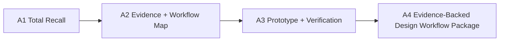

# Assignment Architecture

The assignment sequence should make the studio project the working case from the first class.

## Assignment Arc

## A1: Total Recall

**Purpose**

Audit one prior studio decision and expose how the student built a case for it.

**Required route**

Retrospective. A1 should use a past studio project or a stable completed design decision.

**Deliverables**

- one project image or diagram
- one specific design decision
- original alternatives
- evidence used at the time
- what the evidence actually supported
- assumptions, precedent, intuition, or tutor preference
- missing variable, range, threshold, or workflow
- one-page Total Recall board

**Why this matters**

This gives every student a stable case before current studio chaos enters the course.

## A2: Evidence + Workflow Map

**Purpose**

Translate the chosen design decision into possible evidence workflows.

**Deliverables**

- evidence map
- tool translation matrix
- candidate workflow route
- source quality and access notes
- preliminary variable/range/threshold
- A4 branch preview

**Workflow routes**

| Route | Best for |
|---|---|
| GH / parametric workflow | geometry alternatives, option families, form-performance relationships |
| BIM/BEM / simulation literacy | building performance claims, model translation, design-to-analysis assumptions |
| GIS / spatial workflow | site access, zoning, urban context, environmental exposure |
| Python / notebook workflow | repeatable data analysis, visualization, lightweight modeling |
| AI-assisted workflow | scripting, GH/Python help, visual workflow documentation, prompt-driven iteration |
| Spreadsheet / low-code workflow | comparison tables, thresholds, transparent sensitivity checks |

## A3: Workflow Prototype + Verification

**Purpose**

Build one small but working workflow that generates or compares variants/scenarios and produces a decision-relevant output.

**Deliverables**

- input files or sources
- workflow artifact
- generated variants, scenarios, or alternatives
- first evaluation output
- verification notes
- failure log
- uncertainty and assumptions
- short peer reproducibility check

**Minimum standard**

The workflow does not need to be polished. It must be inspectable, and it must show a loop:

input -> variation -> evaluation -> threshold -> design action

## A4: Evidence-Backed Design Workflow Package

Students choose one of two equivalent routes.

### Route A: Retrospective Redesign

Use a past studio project. Rebuild one design decision with better evidence and workflow logic.

Required:

- original decision and original evidence logic
- rebuilt evidence workflow
- outputs from the workflow
- threshold or comparison rule
- what would change in the design
- what remains uncertain
- practice/research communication package
- reproducibility capsule

### Route B: Live Studio Application

Use a current studio project. Apply the workflow to one active design decision.

Required:

- current studio decision being tested
- why the decision matters now
- workflow built in the course
- output from the workflow
- how the output changed, supported, or challenged the studio direction
- next studio action
- what remains unresolved
- practice/research communication package
- reproducibility capsule

## A4 Guardrail

A4 is not a full studio presentation.

It is:

> one design decision improved by one evidence-backed generative workflow.

## Recommended A4 Components

| Component | Length / format | Purpose |
|---|---|---|
| Practice Case | 2 slides | firm/studio-facing decision memo |
| Research Brief | 2 pages | method, evidence, uncertainty, interpretation |
| Object Card | 1 page | dominant figure and recommendation |
| Reproducibility Capsule | small folder/ZIP | README, data dictionary, workflow artifact, figure sources |
| Reflection note | 1 page | what changed, what did not, what transfers |

## A4 Rubric

| Criterion | Weight | Route A interpretation | Route B interpretation |
|---|---:|---|---|
| Decision clarity | 20% | past decision and alternatives are clear | live studio decision and stakes are clear |
| Generative workflow execution | 25% | workflow credibly rebuilds the decision through variants/scenarios | workflow credibly informs current design action through variants/scenarios |
| Evidence quality and uncertainty | 20% | evidence is stronger than original and limits are clear | evidence is usable now and limits are clear |
| Design impact | 20% | shows what would change in the past design | shows what changes, holds, or gets rejected in current studio |
| Documentation and reproducibility | 15% | capsule allows inspection | capsule allows inspection |

## Peer Review + Mentor Dialogue

Keep these from the DCP because they reinforce professional relevance.

| Item | Timing | Function |
|---|---|---|
| Peer review 1 | Week 5 or 6 | test evidence map and workflow route |
| Peer review 2 | Week 9 or 10 | test threshold and recommendation |
| Mentor dialogue | Week 8 or 9 | stress-test method, data source, or practice relevance |
| Change logs | after reviews | show how feedback changed the workflow |

## Level Differentiation

| Level | Expected scope |
|---|---|
| Undergraduate | tightly bounded decision, low-code or scaffolded workflow, clear documentation |
| MArch | stronger studio/practice stakes, independent workflow troubleshooting, actionable recommendation |
| PhD/RPg | deeper method critique, stronger uncertainty handling, reproducible analysis structure |
