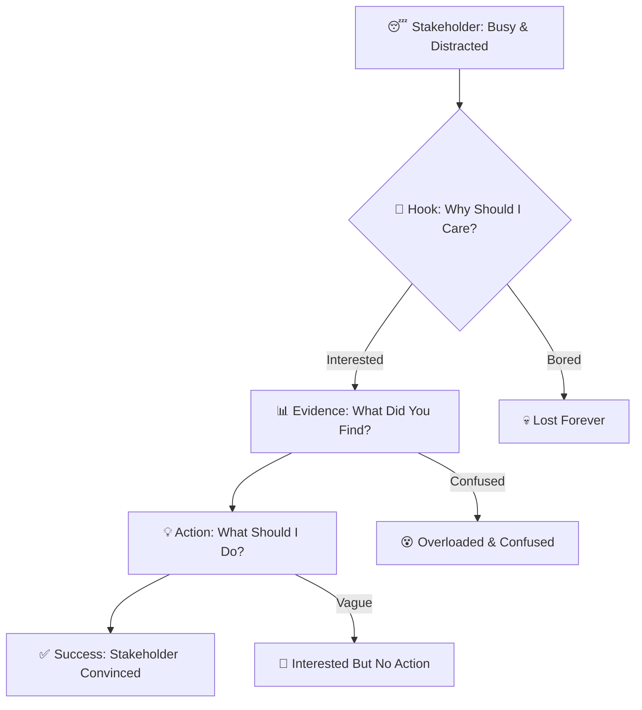
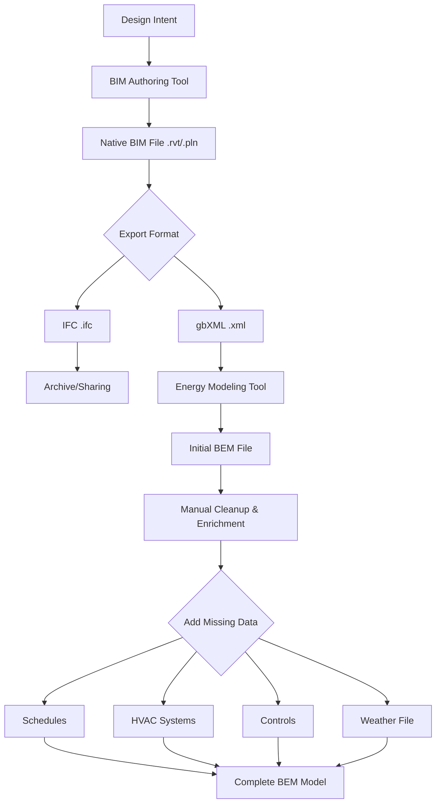
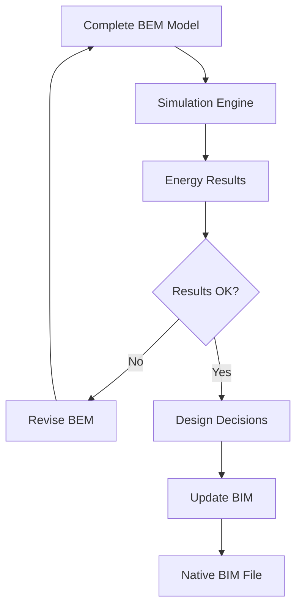

## 🎬 Welcome to the Story Wars! {.center}

::: {.callout-important icon=false}
## Today's Epic Battle: Who Tells the Best Story?

**The Ultimate Challenge**: Transform your semester of hard work into a story so compelling that busy decision-makers will stop scrolling social media to listen

**The Weapons**: Two slides, killer visuals, and narrative superpowers

**The Stakes**: Professional credibility, stakeholder buy-in, and Object Fair domination
:::

**🏆 Today's Championship Events:**

🎭 **Story Structure Showdown** | 📊 **Figure Design Olympics** | 🎤 **Elevator Pitch Battle Royale** | 👥 **Peer Review Arena** | 🎨 **Object Card Design Wars**

---

# Round 1: The Great Story Disasters {background-color="#8B0000"}

---

## 💀 When Good Research Goes Bad (Story Edition)

**Before we become storytelling champions, let's learn from the narrative graveyard...**

::: {.callout-warning icon=false}
## 🏢 Case 1: The $50M Miscommunication

- PhD researcher presents brilliant energy analysis to a Hong Kong developer board
- 45 minutes on methodology vs 30 seconds on business impact
- Board: "Interesting... but what should we actually DO?"
- Result: No adoption, project shelved, researcher benched
:::

---

## 💀 When Good Research Goes Bad — Case 2

::: {.callout-warning icon=false}
## 📊 The Chart Catastrophe

- Consultant shows 47 different charts to a planning committee
- Every chart technically perfect yet offers no clear action
- Committee: "We're more confused than when we started"
- Result: Status quo wins and the innovative solution dies
:::

---

**🤔 Reality Check**: How many of your presentations focus more on HOW you did it than WHY anyone should care?

---

## 🎯 The Two-Slide Death Match

**⚡ The challenge**: Distill your ENTIRE semester into exactly 2 slides that would make a busy stakeholder stop what they're doing and take action.

**Plot twist**: We'll test which structure actually WORKS with real stakeholders!

---

## Choose Your Story Structure

::: {.callout-note icon=false}
## Battle Stations

- Move to corners of the room based on your current approach
- **🔥 Action Corner**: "I start with what they should DO"
- **📊 Evidence Corner**: "I start with what I FOUND"
- **😰 Problem Corner**: "I start with what's WRONG"
- **🤷 Confusion Corner**: "I honestly have NO IDEA how to start"
- 3 minutes to convince other corners why YOUR approach wins!
:::

---

## 🎬 The Story Structure Science

**🧠 Cognitive Science Reality**: Human brains process stories in predictable patterns.

---

## Story Flow

---

## ⏰ Hook Them Fast

**You have 15 seconds** to grab attention or lose them forever!

---

# Round 2: BIM & BEM Fundamentals - The Data Behind the Buildings {background-color="#4B0082"}

---

## 🏗️ What Are BIM and BEM?

**Understanding the two critical data ecosystems in modern architecture**

---

## Building Information Modeling (BIM)

::: {.callout-note icon=false}
- Definition: Digital representation of a building's physical and functional characteristics
- Purpose: Supports design, construction, and facility management
- Focus: Geometry, materials, spatial relationships, construction sequences
- Users: Architects, engineers, contractors, facility managers
- Formats: IFC (.ifc), Revit (.rvt), ArchiCAD (.pln), gbXML (.xml)
:::

---

## Building Energy Modeling (BEM)

::: {.callout-note icon=false}
- Definition: Computational representation of a building's energy flows and thermal behavior
- Purpose: Energy performance analysis, optimization, and compliance
- Focus: Thermal zones, HVAC systems, schedules, weather data, energy consumption
- Users: Energy analysts, sustainability consultants, MEP engineers
- Formats: EnergyPlus (.idf), OpenStudio (.osm), eQuest (.inp), TRNSYS (.dck)
:::

---

## 📊 The BIM Data Structure

**How is geometric and construction information actually organized?**

---

## BIM Hierarchy — Macro View

- **Project** → Contains all building information
- **Site** → Location, orientation, context
- **Building** → One or more structures
- **Stories/Levels** → Floor-by-floor organization

---

## BIM Hierarchy — Detailed View

- **Spaces/Rooms** → Individual zones
- **Building Elements** → Walls, floors, windows, doors
- **Components** → Materials, layers, properties
- **Properties** → Thermal, structural, cost data

---

## Key BIM Data Components — Geometry & Attributes

**1. Geometry**

- 3D coordinates and shapes
- Parametric relationships (walls connect to floors)
- Topological connections between elements

**2. Attributes**

- Material properties (conductivity, density, specific heat)
- Construction details (layer thickness, assembly type)
- Performance data (R-values, U-values, SHGC)

---

## Key BIM Data Components — Relationships

**3. Relationships**

- Spatial containment (window within wall)
- Connections (wall joins floor)
- Systems (window part of exterior envelope system)

---

## ⚡ The BEM Data Structure

**How is energy performance actually calculated?**

---

## BEM Zone-Based Organization

- **Building** → Overall energy system
- **Thermal Zones** → Spaces with similar thermal behavior
- **Surfaces** → Walls, roofs, floors (heat transfer boundaries)
- **Constructions** → Material layers with thermal properties
- **Internal Loads** → People, lights, equipment
- **HVAC Systems** → Heating, cooling, ventilation
- **Schedules** → Occupancy, equipment usage patterns

---

## Site Context Inputs

- **Weather Data** → Hourly temperature, solar radiation, wind
- **Shading** → Adjacent buildings, landscape

---

## Critical BEM Elements — Zones & Constructions

**1. Thermal Zones**

- Volume and floor area
- Thermostat setpoints (heating/cooling)
- Ventilation requirements
**2. Constructions**

- Material layers (inside → outside)
- Thermal resistance of each layer
- Thermal mass and heat capacity

---

## Critical BEM Elements — Schedules & Systems

**3. Schedules**

- Occupancy patterns (hourly, daily, seasonal)
- Equipment operation times
- Lighting schedules

**4. Systems**

- HVAC equipment types and efficiencies
- Distribution systems (ductwork, pipes)
- Control strategies

---

## 🔄 Quick Check: BIM vs BEM Thinking

**💡 5-Minute Partner Challenge**

**Scenario**: You're modeling a south-facing office with a large window.

---

## Quick Check – Question 1

**What would a BIM model care about?**

- A) Window size, frame material, glass type, cost
- B) Solar heat gain coefficient, U-value, thermal mass
- C) Both equally
- D) Neither - just the visual appearance

---

## Quick Check – Question 2

**What would a BEM model care about?**

- A) Exact window manufacturer and product code
- B) Window thermal properties and solar transmission
- C) Construction sequencing and installation method
- D) Visual aesthetics and daylighting quality

---

## Quick Check – Question 3

**Which model needs to know about occupancy schedules?**

- A) BIM only
- B) BEM only
- C) Both
- D) Neither

**🎯 Discuss answers with partner - we'll reveal the correct answers and why they matter!**

---

## ✅ Quick Check Answers

**Question 1**: **A** - BIM cares about physical/construction properties

- BIM focuses on what to build and how to build it
- Material specifications, dimensions, costs, constructability

---

## ✅ Quick Check Answers — Q2

**Question 2**: **B** - BEM cares about thermal/energy properties

- BEM focuses on how the building performs energetically
- Heat flows, solar gains, thermal resistance matter for energy calculations

---

## ✅ Quick Check Answers — Q3

**Question 3**: **B** - BEM needs schedules for energy calculations

- BIM might document space programs, but doesn't need hourly schedules
- BEM requires schedules to calculate time-varying energy use

**🤔 Key Insight**: Same building, completely different data priorities!

---

<!-- 
# Round 3: Figure Design Olympics {background-color="#006400"}

---

## 🎨 The Visualization Gladiator Arena

**🏆 Championship Categories**
- 📊 Speed Chart Challenge (10 minutes)
- 🎯 Message Clarity Championships (15 minutes)
- 🔥 Uncertainty Communication Olympics (12 minutes)
- 💎 Professional Polish Finals (18 minutes)

---

## 📊 Speed Chart Challenge

Transform this terrible chart into presentation gold!

**Rules**: Same data, maximum impact, stakeholder-friendly

---

## ⚡ Speed Chart Battle Royale

**Problems with this chart:**
- 47 different data series (seriously!)
- No clear message or takeaway
- Tiny text, confusing colors
- Overwhelming for stakeholders

**⏰ 10-minute transformation challenge!**

---

## Speed Chart Rescue Formula

::: {.callout-tip icon=false}
1. **One Message Rule**: What's the ONE thing stakeholders need to know?
2. **3-Second Test**: Key insight obvious immediately?
3. **Annotation Strategy**: Use text to guide interpretation
4. **Color Purpose**: Every color choice supports the message
5. **Context Connection**: How does this relate to stakeholder decisions?
:::

**🏆 Judging**: Present your transformation in 60 seconds!

---

## 🎯 The 3-Second Message Test

**🧠 Brain Science**: Stakeholders form first impressions in 3 seconds

**Challenge**: Create figures that pass the "conference coffee break test"

*Scenario: Busy stakeholder walks past your poster with coffee, glances for 3 seconds while walking. Do they "get it"?*

---

## 🏃 Live Testing Protocol

1. Create your figure (10 minutes)
2. Speed dating rounds (30 seconds each): show the figure for 3 seconds and capture what your partner understood
3. Compare to your intended message and iterate rapidly
4. Championship round: Best 3-second clarity wins!

---

## Common 3-Second Failures

::: {.callout-warning}
- ❌ Chart Title: "Analysis of Building Performance Metrics Across Various Scenarios"
- ✅ Chart Title: "South-facing offices need blinds to prevent glare"
- ❌ Chart Message: Hidden in data, requires interpretation
- ✅ Chart Message: Annotated, highlighted, impossible to miss
:::

---

## 📐 Professional Polish Transformation Lab

**🎨 Design Clinic Format**: 5-minute individual consultations while others work.

**Bring your WORST figure** (we all have one!) for emergency makeover.

---

## 🚑 Figure Emergency Room

**Triage Categories**
- 🔴 Critical: Completely incomprehensible, multiple fatal errors
- 🟡 Urgent: Technically correct but unprofessional presentation
- 🟢 Stable: Good content, needs minor polish for Object Fair

---

## Treatment Plans

- **Typography therapy**: Font hierarchy, readability, professionalism
- **Color surgery**: Strategic use, accessibility, brand consistency
- **Layout operation**: White space, alignment, visual flow
- **Message transplant**: Clear communication of key insights

---

::: {.callout-success}
## Before/After Showcase

**Share your transformation!**

- 30 seconds: Show before version (no shame, we've all been there!)
- 30 seconds: Reveal after version
- 30 seconds: Explain what changed and why it works better

**Vote**: Most dramatic improvement wins the "Phoenix Award" 🔥→🦋
:::

-->

# Round 3: From Design to Data - BIM/BEM File Generation {background-color="#FF4500"}

---

## 🔨 Where Do These Files Come From?

**Understanding the complete workflow from design intent to energy analysis**

---

## BIM Generation: Manual Creation

- **Origin**: Designer creates geometry in BIM software (Revit, ArchiCAD, etc.)
- **Process**: Draw walls, place windows, define materials; assign properties; organize spaces and systems
- **Output**: Native BIM file (.rvt, .pln) or neutral format (IFC)
- **Pros**: Full design control, rich detail, integrated workflow
- **Cons**: Time-intensive, requires BIM expertise, manual updates

---

## BIM Generation: 3D Model Import

- **Origin**: Import from other 3D tools (SketchUp, Rhino, etc.)
- **Process**: Bring in "dumb" geometry, add semantic tags, assign materials and properties
- **Output**: Enriched BIM model
- **Pros**: Leverages existing 3D models, design freedom
- **Cons**: Requires significant cleanup and semantic tagging

---

## BIM Generation: Point Cloud Capture

- **Origin**: 3D scanning of existing buildings
- **Process**: Collect laser scan/photogrammetry point clouds, convert to BIM geometry, estimate materials and conditions
- **Output**: As-built BIM model
- **Pros**: Accurate existing conditions, useful for renovations
- **Cons**: Estimates required for hidden properties, labor-intensive

---

## ⚡ The BEM Generation Pathway

**How do we get from buildings to energy models?**

---

## BEM Generation: BIM-to-BEM Translation

- **Origin**: Existing BIM model
- **Process**: Export to gbXML/IFC, import into energy tool, auto-detect zones, surfaces, and default schedules/systems
- **Output**: Initial BEM file (.idf, .osm, .inp)
- **Pros**: Fast, leverages BIM work, reduces duplication
- **Cons**: Requires extensive cleanup, often missing critical energy data

---

## BEM Generation: Direct Energy Modeling

- **Origin**: Design documents, specifications, or simplified geometry
- **Process**: Analyst builds simplified geometry, defines thermal zones, assigns detailed schedules, systems, and controls
- **Output**: Purpose-built BEM file
- **Pros**: Energy-focused detail, analyst control
- **Cons**: Disconnected from BIM, duplicate effort, manual updates

---

## BEM Generation: Template-Based Modeling

- **Origin**: Building archetype or prototype models
- **Process**: Start with reference, adjust geometry, systems, and schedules to match project specifics
- **Output**: Customized BEM from template
- **Pros**: Fast, proven assumptions, reduced errors
- **Cons**: Unique design features may be lost, less accurate for unusual buildings

---

## 🗺️ Workflow Map — Modeling Phase

---

## 🗺️ Workflow Map — Iteration Loop

---

## 📝 The Critical "Translation Gap" Problem

**What gets lost when converting BIM → BEM?**

---

## Geometry Issues

- Simplified too much: Curved facades become straight walls
- Simplified too little: Every door frame exported as a thermal zone
- Wrong orientation: Building rotates during export
- Missing context: Adjacent buildings and shading lost

---

## Thermal Zoning Problems

- BIM spaces ≠ Thermal zones: Conference room becomes four separate zones
- Open office areas fragment into dozens of zones
- Missing plenum zones: Return air paths not captured

---

## Material & Construction Gaps

- Generic assignments: "Exterior wall" without layers or R-value
- Missing internal mass: Furniture and partitions ignored
- No thermal bridges: Connections and penetrations simplified

---

## Operational Data Missing

- No schedules: BIM doesn't know when lights turn on or off
- No HVAC systems: Architectural spaces lack mechanical definitions
- No controls or set points: Thermostat strategies undefined

---

## ✅ What Translates Well

- Basic geometry (walls, floors, windows)
- Surface areas and window-to-wall ratios
- Orientation and overall building footprint

---

## 🎯 Hands-On: Translation Detective Challenge

**⏰ 10-Minute Group Activity**

**Scenario**: You've exported a BIM model to gbXML and opened it in an energy modeling tool. The initial results show the building uses **3× more energy** than expected!

**Your Mission**: Identify what likely went wrong in the translation.

---

## Translation Detective — Given Info

- Building: 5-story office building with open floor plan
- BIM model: Very detailed architectural model with every furniture piece modeled
- Translation: Automated gbXML export with default settings
- BEM result: 450 kWh/m²/year (expected: 150 kWh/m²/year)

---

## Detective Questions

1. How many thermal zones were likely created?
2. What might be wrong with the HVAC system in the energy model?

3. What schedules are likely being used?

4. What's probably missing that would reduce the energy use?

**🎯 Groups report out findings - let's debug this together!**

---

# Round 4: BIM-BEM Interoperability - The Integration Challenge {background-color="#800080"}

---

## 🔗 Why Can't BIM and BEM Just Talk to Each Other?

**Fundamental challenge**: Two models, same building, completely different purposes.

---

## BIM's Core Question

**"What do we build and how?"**

- Detailed geometry for construction
- Material specifications for procurement
- Cost data for budgeting
- Schedule for sequencing

---

## BEM's Core Question

**"How will it perform energetically?"**

- Simplified geometry for calculation speed
- Thermal properties for heat flow
- Operational assumptions for usage patterns
- Weather data for climate response

---

## Detail Mismatch

**🎯 Construction detail needs ≠ Energy analysis detail needs**

---

## 🌉 The Translation Bridges: IFC vs gbXML

**Two competing standards for BIM-to-BEM data exchange**

---

## IFC Basics

::: {.callout-note icon=false}
- Created by buildingSMART International (1990s)
- Purpose: Comprehensive BIM data exchange across disciplines
- Scope: Entire building lifecycle
- Energy focus: Minimal originally, improving with Model View Definitions
:::

---

## IFC Strengths & Weaknesses

- Strengths: Vendor-neutral, comprehensive information, widely adopted, supports complex geometry
- Weaknesses: Data overload, inconsistent energy values, unclear thermal zoning, poorly defined HVAC for analysis
- Common use: Archiving and coordination between architects, engineers, and contractors

---

## gbXML Basics

::: {.callout-note icon=false}
- Created by Green Building XML Schema Inc. (2000)
- Purpose: BIM-to-energy model translation
- Scope: Geometry, materials, and context for energy analysis
- Energy focus: Designed explicitly for simulation tools
:::

---

## gbXML Strengths & Weaknesses

- Strengths: Purpose-built for energy analysis, cleaner thermal zones, faster processing, better baseline HVAC support
- Weaknesses: Limited to energy data, inconsistent vendor implementations, less construction detail, semi-open governance
- Common use: Exporting from Revit/ArchiCAD to OpenStudio, eQuest, or IES-VE

---

## 📊 IFC vs gbXML — Technical Focus

| Feature | IFC | gbXML | Winner |
|---------|-----|-------|--------|
| **Geometric Accuracy** | Very high (construction-grade) | Medium (energy-grade) | IFC |
| **Thermal Zone Definition** | Poor (not its focus) | Good (designed for this) | gbXML |
| **Material Properties** | Comprehensive (but not thermal) | Thermal-focused | gbXML |
| **HVAC Systems** | Detailed (but not for energy calc) | Simplified (but usable) | gbXML |

---

## 📊 IFC vs gbXML — Adoption & Speed

| Feature | IFC | gbXML | Winner |
|---------|-----|-------|--------|
| **File Size / Speed** | Large, slow | Smaller, faster | gbXML |
| **Industry Adoption (BIM)** | Very high | Medium | IFC |
| **Industry Adoption (Energy)** | Growing | High | gbXML |
| **Open Standard** | Yes (buildingSMART) | Semi-open | IFC |

**🎯 Reality Check**: Neither is perfect! Most workflows require manual cleanup after translation.

---

## 🛠️ How Models Stay Updated (Or Don't!)

**Lifecycle synchronization challenge**

---

## Ideal World Workflow

1. Design in BIM → update geometry, materials, systems
2. Auto-export to BEM with minimal manual fixes
3. Run energy simulation and review performance
4. Iterate design changes back in BIM
5. Repeat as BEM updates automatically

---

## Why Ideal Workflow Fails

- Translation errors require manual BEM fixes
- Manual fixes get overwritten on the next export
- Models diverge over the project lifecycle
- No clear version control between BIM and BEM

---

## Real-World Workflow

1. Initial BIM: create architectural model
2. Export to BEM: one-time translation
3. Manual BEM refinement: zones, schedules, systems
4. BIM continues evolving with design changes
5. BEM freezes because rework is too expensive
6. Final disconnect: As-built BIM ≠ simulated model

---

## Divergence Consequences

- Energy predictions may not match as-built reality
- Hard to track which design changes were analyzed
- Wasted effort recreating models
- Compliance documentation can misalign with construction

---

## Current Industry Approaches

**Approach 1: Periodic Re-synchronization**

- Major milestones trigger new BIM → BEM exports
- Analyst tracks manual adjustments and reapplies them

---

## Parallel Development

- Maintain BIM and BEM separately
- Use BIM as reference while manually updating BEM geometry
- Treat them as related but independent models

---

## BEM-First Simplification

- Create a simplified energy massing model early
- Use it for analysis throughout the project
- Accept it won't match detailed BIM exactly

---

## 🎯 Case Study: Translation Gone Wrong

- Project: New university research building, 6 stories, 15,000 m²
- BIM Tool: Revit with MEP coordination
- Energy Tool: OpenStudio/EnergyPlus
- Goal: LEED Gold energy modeling

---

## Week 1: "Success"

- Architect exports Revit model to gbXML
- OpenStudio imports without errors
- Team celebrates the "seamless" workflow

---

## Week 2: Problems Surface

- 465 thermal zones created (expected ~30); closets and corridors become separate zones
- No HVAC systems defined (everything unconditioned)
- Generic wall constructions with identical R-values
- Window properties missing and the building rotated 90°

---

## Week 3-4: Manual Cleanup

- Merge zones from 465 down to 32
- Input construction assemblies and material properties
- Define HVAC systems from MEP drawings
- Create occupancy and equipment schedules
- Fix orientation and add context shading
- Time spent: 40+ hours

---

## Week 8: Design Changes

- Window sizes change, interior walls move, roof design shifts
- Dilemma: Re-export and lose 40 hours or manually update BEM?
- Solution: Manual BEM updates with documentation, hope nothing drastic changes again

---

## Lessons Learned — What Went Wrong

- Default gbXML export settings were inappropriate for energy modeling
- BIM was not created with energy analysis in mind
- Missing data went unnoticed until after export
- No workflow existed to manage updates

---

## Lessons Learned — What Should Happen

- Clean up BIM before export and consolidate zones
- Define construction assemblies inside BIM prior to translation
- Coordinate with MEP for HVAC system information
- Plan iterative updates with version control

---

## 🎮 Hands-On Challenge: BIM-BEM Divergence Detective

**⏰ 12-Minute Group Activity**

**Scenario**: Actual energy use is 30% higher than the model predicted because BIM and BEM diverged. Investigate why!

---

## Divergence Detective — Given Info

- BIM model (as-built) is fully updated through construction
- Energy model froze at Design Development
- 14-month gap between the frozen model and building operation

**Your mission**: Find what diverged and why it matters.

---

## Investigation Categories

- Geometry changes: Which design tweaks could spike energy use?
- Construction/materials: What value engineering degraded performance?
- Systems: How might HVAC equipment or controls differ?
- Operations: Where do real schedules differ from assumptions?

**🎯 Present your top three suspects and impacts!**

---

# Round 5: Object Card Design Wars {background-color="#DC143C"}

---

## 🎨 The Ultimate Visual Communication Challenge

**🏆 Mission**: Create a poster so compelling that people fight over who gets to work with you.

---

## ⚡ The 30-Second Poster Test

**Scenario**: During Object Fair, a stakeholder glances at your poster for 30 seconds while walking.

1. **Stop walking** (3 seconds)
2. **Read your message** (15 seconds)
3. **Take action** (contact you, ask questions, offer collaboration)

---

## Design Challenge — Message Hierarchy

- One clear message dominates the design (10 minutes)
- Supporting evidence stays visible but secondary
- Contact/action information is easy to find without clutter

---

## Design Challenge — Visual Impact

- Compelling from 6 feet away (15 minutes)
- Professional quality suitable for your portfolio
- Memorable enough to be recognized later

---

## Design Challenge — Stakeholder Test

- Works for multiple stakeholder types (12 minutes)
- Language stays friendly for non-experts
- Action items remain clear and specific

---

## 🔥 Live Design Laboratory

- 15-minute individual consultations while others work
- Bring your Object Card draft for rapid feedback

---

## 🚨 Object Card Emergency Room

- 🟢 Green Zone: Professional quality, clear message, ready for Object Fair
- 🟡 Yellow Zone: Good content, needs polish and clarity improvement
- 🔴 Red Zone: Complete redesign needed, unclear message, unprofessional appearance

---

## ⚡ Speed Design Clinic

- Bring: Current Object Card draft (any stage)
- Get: Specific design feedback and rapid improvement strategies
- Focus: Maximum impact changes for minimum time investment

---

## Object Card Success — Message Dominance

::: {.callout-tip icon=false}
- ONE key finding or recommendation as the hero
- Everything else supports that primary message
- Pass the 3-second understanding test
:::

---

## Object Card Success — Visual Hierarchy

::: {.callout-tip icon=false}
- Use size, color, and position to guide attention
- Most important = biggest, boldest, best position
- Less important = smaller, neutral, secondary placement
:::

---

## Object Card Success — Professional Polish

::: {.callout-tip icon=false}
- Maintain consistent fonts, colors, and spacing
- Use high-quality images and graphics
- Print-test at actual size before finalizing
:::

---

## Object Card Success — Action Orientation

::: {.callout-tip icon=false}
- Provide clear contact information
- Offer specific next steps for interested stakeholders
- Highlight memorable personal branding
:::

---

## 🏆 Object Card Championship Judging

**Vote with phones for real-time results and record why each winner succeeded.**

- 🎯 Clearest Message
- 👁️ Best Visual Impact
- 💼 Most Professional
- 🤝 Most Stakeholder-Friendly
- 🔥 Most Memorable

---

## 🎪 Hall of Fame Gallery

- Capture message hierarchy examples that made key points dominant
- Document visual impact techniques (color, layout, typography)
- Note professional polish details that separated good from great
- Highlight stakeholder-friendly language that avoided jargon

---

# Final Boss Challenge: Why Are BIM & BEM Different? {background-color="#B8860B"}

---

## 🧩 The Ultimate Integration Question

**Why can't we just have ONE model that does everything?**

**Think about it**: We can simulate physics, manage construction, track costs, and coordinate trades. So why keep BIM and BEM separate?

---

## 🎯 Group Challenge: Defend or Critique

- ⏰ 15-minute structured debate
- Split into three positions and prepare arguments

---

## 🔵 Team "Unified Model"

- Argue that BIM and BEM should combine into one integrated model
- Highlight benefits of a single source of truth
- Explain how technology could bridge the gap
- Describe what a unified model looks like and its efficiencies

---

## 🔴 Team "Separate Forever"

- Argue why different purposes require different tools
- Explain computational and practical limitations
- Defend existing industry practice
- Describe why integration attempts often fail

---

## 🟡 Team "Hybrid Future"

- Advocate for better integration without full unification
- Identify what data should be shared vs. remain separate
- Design realistic interoperability enhancements
- Balance big ideas with practical constraints

---

## 🔬 Fundamental Difference 1: Computational Complexity

**BIM Priority**: Visual accuracy, construction detail, documentation clarity
- Can handle millions of polygons
- Focuses on representing what you see
- Rendering speed matters more than calculation speed
**BEM Priority**: Simulation speed, numerical stability, annual calculations
- Must run 8,760 hours of calculations
- Simplified geometry keeps simulations fast
- Trades visual accuracy for computational efficiency
**💡 Insight**: A photorealistic model is useless if it takes 40 hours to simulate one option.

---

## 🔬 Fundamental Difference 2: Temporal Resolution

**BIM**: Mostly static snapshot
- Documents specific design phases
- Tracks changes as versions, not continuous time
- Doesn't model operations across the year
**BEM**: Inherently time-dynamic
- Simulates every hour of the year
- Accounts for weather, occupancy, solar angles
- Captures thermal mass, system cycling, seasonal variations
**💡 Insight**: BIM says "this is the wall"; BEM says "here's how it behaves at 2 AM vs. 2 PM."

---

## 🔬 Fundamental Difference 3: Data Precision vs. Assumptions

**BIM**: Strives for precision and specification

- Exact dimensions and thicknesses
- Specific products (Brand X window, Model 123)
- As-specified or as-built documentation

**BEM**: Embraces necessary assumptions

- Typical occupancy patterns and usage
- Representative weather data
- Estimated operations rather than guaranteed behavior

**💡 Insight**: BIM pretends to certainty; BEM communicates probability.

---

## 🔬 Fundamental Difference 4: Geometry Philosophy

**BIM**: Parametric, relationship-based, construction-logical

- Walls connect to floors with defined relationships
- Changes propagate through dependencies
- Maintains constructability rules

**BEM**: Thermal boundary-based, physics-logical

- Surfaces define heat flow boundaries
- Zones organized by thermal similarity
- Maintains energy balance requirements
**💡 Insight**: BIM thinks in elements; BEM thinks in heat-transfer surfaces.

---

## 🏆 Critical Alignment Points

- ✅ Basic geometry (footprint, height, orientation, massing)
- ✅ Envelope areas (total wall, window, and roof surface)
- ✅ Material thermal properties (U-values, SHGC)
- ✅ Space programs (square footage by use type)

---

## Acceptable Divergence Points

- ⚠️ Thermal zoning (BEM zones ≠ BIM spaces)
- ⚠️ Geometric detail (BEM simplified, BIM detailed)
- ⚠️ Systems representation (BEM parametric, BIM documented)
- ⚠️ Temporal information (BEM schedules vs. mostly static BIM)

---

## Reflection — Semester Project

- Which aspects of BIM and BEM must align precisely?
- Where can you accept simplification or divergence?
- How will you document the relationship between models?

---

## Reflection — Stakeholder Communication

- How will you explain model differences to non-experts?
- What uncertainties must you communicate?
- How do you build confidence despite limitations?

---

## Reflection — Future Practice

- What workflow lessons will you take forward?
- Which tools or skills do you need to develop?
- How will you manage integrated modeling projects?

---

# Victory Celebration & Integration {background-color="#FFD700"}

---

## 🎉 What You Conquered Today

::: {.callout-success icon=false}
- **🏗️ Data Structure Mastery**: You understand how BIM and BEM organize building information differently
- **🔄 Workflow Wisdom**: You know where these files come from and how they're generated
- **🌉 Translation Insight**: You can anticipate what gets lost when converting BIM → BEM
- **⚠️ Interoperability Reality**: You understand why "seamless" integration is rarely seamless
:::

---

## More BIM/BEM Superpowers

::: {.callout-success icon=false}
- **🧩 Critical Thinking**: You can articulate why BIM and BEM must be different (and where they should align)
- **📊 Visual Communication**: You can design figures that pass the 3-second test
- **🎨 Presentation Skills**: Your Object Card effectively communicates complex technical work
- **Most importantly**: You understand the data foundations behind performance analysis
:::

---

## 🚀 Object Fair Preparation Mastery

::: {.callout-important icon=false}
## Level 1 — Presentation Survival ✅

1. Complete Peer Review #2 using today's feedback framework
2. Implement the winning story structure
3. Polish key figures until they pass the 3-second test
:::

---

## Victory Checklist — Level 2 🎖️

::: {.callout-important icon=false}
4. Master your elevator pitch until it's effortless
5. Finalize an Object Card worthy of printing
6. Validate your story with someone outside class
:::

---

## Victory Checklist — Level 3 🥷

::: {.callout-important icon=false}
7. Prepare pitch variants for different stakeholders
8. Practice Q&A responses to likely questions
9. Prep networking assets (business cards, LinkedIn, follow-up plan)
:::

**Commitment check**: Choose your level and announce it to your neighbor! 📣

---

## 🔮 Week 10 Preview: Draft Defense Gladiator Arena

**Get ready for**: 
- Individual presentations to full professional panel
- Real-time feedback and improvement suggestions  
- Final polish identification and strategy development
- Object Fair logistics and networking preparation

**The stakes**: This is your dress rehearsal before the real show!

---

## 🎊 Exit Victory Ritual

::: {.callout-warning icon=false}
## The Storyteller's Oath

**Stand up and repeat after me:**

*"I solemnly swear to tell stories that make stakeholders stop what they're doing and listen."*

*"I will create visuals so clear that the message jumps off the page in 3 seconds."*

*"I will pitch my work with such clarity and confidence that opportunities will seek me out."*

*"I will remember that great research means nothing if it can't change the world."*

**Now high-five someone and promise to help each other dominate at Object Fair!** 🙌
:::

---

## 🎯 Final Mission

**Go forth and tell stories that change the built environment!**

---

*"Great research without great storytelling is just expensive data. Great storytelling without great research is just marketing. You now have both!"* ⭐

**Next week: The final gladiator test before Object Fair glory!** 🏆
