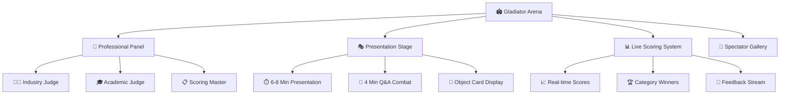

## ⚔️ Welcome to the Gladiator Arena! {.center}

::: {.callout-important icon=false}
## Today's Epic Battle: The Draft Defense Tournament

**The Challenge**: Present your semester's work to a professional panel and emerge victorious

**The Stakes**: Object Fair readiness, professional credibility, and champion status

**The Prize**: Feedback so good it transforms your final presentation from good to legendary
:::

**🏆 Today's Championship Events:**

⚔️ **Professional Presentation Tournament** | 🎯 **Rapid-Fire Feedback Arena** | 📊 **Improvement Strategy Lab** | 🔥 **Object Fair Prep Bootcamp**

**🎪 Format**: Gladiator-style presentations with live scoring, professional panel feedback, and immediate improvement strategy development

---

# Arena Rules & Championship Format {background-color="#1A1A2E"}

---

## 🏛️ The Gladiator Arena Setup



**🎯 Your Mission**: Survive the arena and emerge as a presentation champion!

---

## 🎪 Championship Categories & Scoring

### 🏆 Live Tournament Brackets

**📊 Real-time Scoring** (displayed on screen):

| Gladiator | Content Mastery | Professional Delivery | Stakeholder Impact | **Total** |
|-----------|-----------------|---------------------|-------------------|-----------|
| Fighter 1 | ?/30 | ?/30 | ?/30 | **?/90** |
| Fighter 2 | ?/30 | ?/30 | ?/30 | **?/90** |
| Fighter 3 | ?/30 | ?/30 | ?/30 | **?/90** |

### 🥇 Champion Categories

- **🎯 Most Strategic**: Best stakeholder-focused presentation
- **📊 Evidence Master**: Strongest research and findings
- **🎤 Presentation Pro**: Most confident and professional delivery
- **💡 Innovation Leader**: Most creative approach or insights
- **🔥 Crowd Favorite**: Audience choice award

::: {.callout-tip}
## Professional Panel Composition

**Today's Arena Judges:**
- 🏢 **Industry Professional**: Real-world application expert
- 🎓 **Academic Expert**: Research methodology specialist  
- 📋 **Communication Coach**: Presentation skills evaluator

*Each brings different perspectives to maximize feedback value*
:::

---

# Round 1: Opening Ceremonies {background-color="#16213E"}

---

## 🎺 Arena Introduction & Combat Rules

### ⚔️ Gladiator Presentation Combat Rules

**🕐 Timing**:
- **6-8 minutes**: Core presentation (arena timer displayed)
- **4 minutes**: Q&A combat with panel
- **2 minutes**: Immediate feedback and scoring

**🎯 Victory Conditions**:
- Clear problem framing and stakeholder relevance
- Evidence-based findings with confidence levels
- Actionable recommendations with implementation guidance
- Professional delivery under pressure

**🏛️ Arena Etiquette**:
- Gladiators support fellow combatants
- Panel feedback is constructive and professional
- Spectators engage respectfully and learn from each battle

---

## 🎲 Gladiator Order Selection

**⚡ Random Arena Assignment**:

*The gods of fate (random number generator) will determine combat order...*

::: {.callout-note icon=false}
## Combat Order Revealed!

**Round 1 Gladiators:**
1. _______________
2. _______________
3. _______________

**Round 2 Gladiators:**
4. _______________
5. _______________
6. _______________

**Final Round Champions:**
7. _______________
8. _______________
9. _______________

*Warriors not yet in combat: Serve as engaged audience, take tactical notes, prepare for your arena moment*
:::

**🎪 While Waiting for Combat**: Document successful strategies from fellow gladiators!

---

# Round 2: Gladiator Combat Sessions {background-color="#0F4C75"}

---

## ⚔️ Individual Gladiator Battles

### 🎯 Combat Protocol for Each Fighter

**Pre-Combat Setup** (1 minute):
- Technology check and Object Card display
- Brief gladiator introduction and context
- Arena energy building and support

**Main Combat** (6-8 minutes):
- Professional presentation delivery
- Live scoring by panel during presentation
- Audience engagement and note-taking

**Q&A Combat** (4 minutes):
- Panel challenges and probing questions
- Real-time response under pressure
- Demonstration of expertise and adaptability

**Immediate Feedback** (2 minutes):
- Rapid panel feedback highlights
- Scoring announcement and category recognition
- Strategic improvement suggestions

---

## 📊 Live Combat Analytics

### 🎪 Real-Time Battle Metrics

**Audience Engagement Tracking**:
- 👏 **Energy Level**: How engaged is the crowd?
- 🎯 **Clarity Score**: How clear was the message?
- 💡 **Insight Factor**: What new perspectives emerged?
- 🔥 **Object Fair Readiness**: How ready for prime time?

**Panel Judge Reactions**:
- 💼 **Industry Judge**: Practical application assessment
- 🎓 **Academic Judge**: Research rigor evaluation
- 📋 **Communication Judge**: Presentation effectiveness rating

::: {.callout-success icon=false}
## Live Victory Tracking

**Current Arena Champions:**

🎯 **Most Strategic Leader**: _______________
*Reason*: _______________

📊 **Evidence Master**: _______________
*Reason*: _______________

🎤 **Presentation Pro**: _______________
*Reason*: _______________

💡 **Innovation Leader**: _______________
*Reason*: _______________

*Updated after each combat session!*
:::

---

## 🏆 Gladiator Hall of Fame Moments

### 📸 Documenting Champion Strategies

**🔥 Outstanding Combat Moments**:

*To be filled during actual combat sessions...*

**Presentation Technique Hall of Fame**:
- **Best Opening Hook**: _______________
- **Clearest Stakeholder Connection**: _______________
- **Most Compelling Evidence**: _______________
- **Strongest Call to Action**: _______________

**Q&A Combat Excellence**:
- **Best Limitation Acknowledgment**: _______________
- **Most Professional Response Under Pressure**: _______________
- **Clearest Technical Explanation**: _______________
- **Best Redirection to Key Message**: _______________

**Object Card Display Mastery**:
- **Most Effective Visual Support**: _______________
- **Clearest Message Hierarchy**: _______________
- **Best Professional Design**: _______________

---

# Round 3: Feedback Integration War Room {background-color="#A71D31"}

---

## 🚨 Emergency Improvement Strategy Lab

**⚡ Mission**: Transform panel feedback into Object Fair victory strategy

### 🔥 Rapid Response Protocol

**Phase 1: Feedback Triage** (10 minutes)
- **Critical Issues**: Must fix or Object Fair disaster
- **Important Improvements**: Should fix for professional credibility  
- **Nice-to-Have Polish**: Would fix if time permits

**Phase 2: Strategic Planning** (15 minutes)
- **Week 10 Emergency Fixes**: What must happen this week
- **Week 11 Professional Polish**: What to perfect next week
- **Object Fair Day Preparation**: Final presentation readiness

**Phase 3: Resource Mobilization** (10 minutes)
- **Individual Work Plan**: What you tackle alone
- **Peer Collaboration Opportunities**: Where classmates can help
- **Instructor Consultation Needs**: What requires expert guidance

---

## 📋 The Feedback Integration Matrix

### 🎯 Individual Improvement Battle Plan

**Use this framework to organize your post-combat strategy**:

| Feedback Category | Specific Issue | Improvement Strategy | Timeline | Resources Needed |
|------------------|----------------|---------------------|----------|------------------|
| **Content** | | | | |
| **Delivery** | | | | |
| **Visuals** | | | | |
| **Q&A Prep** | | | | |

### 🤝 Peer Support War Council

**Form Strategic Alliances** (15 minutes):

- **Feedback Exchange**: Share your improvement priorities
- **Skill Trading**: Offer your strengths to help others' weaknesses
- **Practice Partnerships**: Commit to Object Fair prep sessions
- **Resource Sharing**: Pool tools, templates, and expertise

::: {.callout-important}
## Professional Development Insight

**What separates champions from competitors**: How quickly they integrate feedback and improve under pressure

**Today's lesson**: Professional presentation isn't about perfection—it's about confident competence and continuous improvement
:::

---

# Round 4: Object Fair Preparation Bootcamp {background-color="#2E8B57"}

---

## 🎪 Final Arena Preparation Strategy

### 🏆 Object Fair Victory Requirements

**📅 Timeline to Glory**:

```mermaid
gantt
    title Object Fair Victory Timeline
    dateFormat  YYYY-MM-DD
    section Week 10 Emergency
    Critical Fixes     :crit, emergency, 2024-11-04, 7d
    Content Polish     :important, content, 2024-11-04, 7d
    section Week 11 Excellence
    Professional Polish :polish, 2024-11-11, 7d
    Presentation Mastery :presentation, 2024-11-11, 7d
    section Week 12 Glory
    Object Fair Domination :active, victory, 2024-11-18, 1d
```

### ⚡ Week 10 Emergency Action Items

**🚨 Critical Fixes (Must Complete This Week)**:
- [ ] Address all "Critical Issues" from panel feedback
- [ ] Fix any major content or logic problems
- [ ] Resolve technical or visual clarity issues
- [ ] Ensure Object Card is print-ready

**📊 Important Improvements (Should Complete This Week)**:
- [ ] Polish presentation timing and flow
- [ ] Strengthen weakest evidence or arguments
- [ ] Improve stakeholder relevance and connection
- [ ] Enhance visual aids and Object Card design

---

## 🎯 Professional Presentation Mastery Lab

### 🎤 Advanced Combat Training

**Presentation Skills Upgrade** (20 minutes rotating stations):

**Station A: Delivery Excellence** 
- Practice confident posture and voice projection
- Master timing with arena-style pressure
- Develop smooth transitions and natural flow

**Station B: Q&A Combat Training**
- Practice responses to likely challenge questions
- Master professional acknowledgment of limitations
- Develop redirection techniques to key messages

**Station C: Object Card Integration**
- Practice using Object Card as presentation support
- Master attention direction and visual storytelling
- Develop confidence with physical presentation space

**Station D: Stakeholder Adaptation**
- Practice pitch variants for different audience types
- Master elevator pitch delivery under pressure
- Develop networking conversation starters

---

## 🔥 Object Fair Day Success Strategy

### 🏟️ Arena Day Battle Plan

**🕒 Pre-Combat Preparation**:
- **Technology Testing**: Arrive early, test all systems
- **Mental Preparation**: Review key messages and Q&A prep
- **Physical Setup**: Object Card display and material organization
- **Energy Building**: Connect with supporters and build confidence

**⚔️ Combat Performance**:
- **Professional Presence**: Confident demeanor and clear communication
- **Message Mastery**: Deliver key findings with conviction
- **Audience Engagement**: Connect with panel and demonstrate expertise
- **Q&A Excellence**: Handle challenges professionally and confidently

**🎊 Post-Combat Excellence**:
- **Network Like a Champion**: Engage with critics and industry professionals
- **Learn from Others**: Study successful strategies from fellow gladiators
- **Document Victory**: Collect feedback and contact information
- **Celebrate Achievement**: Acknowledge significant accomplishment

::: {.callout-success icon=false}
## Victory Mindset

**Remember**: You've survived the gladiator arena! Object Fair is your victory lap where you demonstrate mastery to industry professionals.

**Key insight**: Today's feedback makes you stronger. Champions aren't those who start perfect—they're those who improve fastest under pressure.
:::

---

# Victory Celebration & Champion Recognition {background-color="#DAA520"}

---

## 🏆 Arena Champions Coronation

### 🎊 Tournament Results & Recognition

::: {.callout-success icon=false}
## Today's Gladiator Champions

**🎯 Most Strategic Gladiator**: _______________
*Victory achieved through*: _______________

**📊 Evidence Master**: _______________
*Victory achieved through*: _______________

**🎤 Presentation Pro**: _______________
*Victory achieved through*: _______________

**💡 Innovation Leader**: _______________
*Victory achieved through*: _______________

**🔥 Crowd Favorite**: _______________
*Victory achieved through*: _______________

**🏟️ Arena Champion** (Highest Overall Score): _______________
*Victory achieved through*: _______________
:::

### 🎖️ Professional Development Medals

**🌟 Most Improved Under Pressure**: Who transformed feedback into immediate improvement?

**🤝 Best Peer Support**: Who helped fellow gladiators succeed?

**💪 Most Resilient**: Who handled challenging questions with grace?

**🚀 Most Object Fair Ready**: Who's prepared to dominate next week?

---

## 📚 Arena Wisdom & Battle Lessons

### 💡 Champion Success Patterns

**What separated arena champions from competitors:**

1. **🎯 Stakeholder Focus**: Champions made relevance obvious immediately
2. **📊 Evidence Confidence**: Champions owned their findings and limitations  
3. **🎤 Professional Delivery**: Champions maintained composure under pressure
4. **🤝 Audience Connection**: Champions engaged rather than just presented
5. **⚡ Adaptation Speed**: Champions integrated feedback in real-time

### 🔮 Object Fair Victory Predictions

**Based on today's arena performance, these gladiators are ready to dominate Object Fair:**

- **Natural Born Leaders**: _______________
- **Technical Powerhouses**: _______________
- **Communication Masters**: _______________
- **Dark Horse Contenders**: _______________

**Everyone else**: Use this week's emergency action plan to join the champion ranks!

---

## 🚀 Week 11 Mission Briefing

::: {.callout-important icon=false}
## Final Polish & Glory Preparation

**🎯 Week 10 Victory Checklist**:

**Level 1: Arena Survival** ✅
1. **Emergency Fixes Complete** - Address all critical panel feedback
2. **Content Polish** - Strengthen weak arguments and evidence
3. **Presentation Timing** - Perfect the 6-8 minute delivery

**Level 2: Professional Excellence** 🎖️  
4. **Object Card Perfection** - Print-ready, portfolio-quality design
5. **Q&A Mastery** - Prepared responses to likely challenges
6. **Stakeholder Adaptation** - Multiple pitch variants ready

**Level 3: Object Fair Domination** 🏆
7. **Network Strategy** - Business cards, LinkedIn, follow-up plan
8. **Professional Presence** - Confident delivery and industry engagement
9. **Champion Mindset** - Ready to represent evidence-based design excellence

**Commitment ceremony**: Stand and declare your chosen level to the arena! 📣
:::

---

## 🎪 Arena Exit Ritual

::: {.callout-warning icon=false}
## The Gladiator's Creed

**All gladiators stand and recite:**

*"I have faced the arena and emerged stronger."*

*"I will use today's battle to forge tomorrow's victory."*

*"I will support my fellow gladiators in their quest for excellence."*

*"I will represent evidence-based design with honor and professional pride."*

*"At Object Fair, I will demonstrate not just what I learned, but who I have become."*

**Now embrace a fellow gladiator and commit to helping each other achieve Object Fair glory!** ⚔️🤝
:::

---

**🎯 Week 11 Preview**: Final Polish Workshop & Object Fair Preparation Mastery

*"Today you proved you can fight. Next week you learn to dominate!"* 🏆

---

*"Gladiators are not born in comfort zones—they are forged in arenas of challenge and emerging victorious!"* ⭐

**Next week: Transform from gladiator to champion with final polish mastery!** 👑
