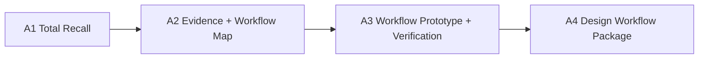

# Assignment Structure

The assignments move from a past studio decision to a working evidence-backed generative design workflow.

## Assignment Timeline

| Assignment | Due | Weight | Main question |
|---|---:|---:|---|
| [A1: Total Recall](assignments/assignment-01.qmd) | Week 3 | 15% | What evidence really supported one past studio decision? |
| [A2: Evidence + Workflow Map](assignments/assignment-02.qmd) | Week 6 | 20% | Which evidence and workflow can rebuild or support the decision? |
| [A3: Workflow Prototype + Verification](assignments/assignment-03.qmd) | Week 9 | 25% | Can the workflow generate or compare variants and produce one interpretable output? |
| [A4: Evidence-Backed Design Workflow Package](assignments/assignment-04.qmd) | Week 12 | 40% | What decision does the workflow improve, and what should happen next? |

## Session 2 Check-Ins

Each assignment is developed through weekly **Project Reasoning Round Tables**.

These are not formal presentations. Students upload one rough material to Slack, speak from it for 60-90 seconds, and leave with one next action for the current assignment.

Use the [Project Reasoning Check-In](templates/project-reasoning-checkin.md) template when useful.

| Assignment | Check-ins that feed it |
|---|---|
| A1 | Week 1 prior decision, Week 2 weak evidence, Week 3 comparison logic |
| A2 | Week 4 spatial evidence, Week 5 model/performance assumptions, Week 6 pathway and A4 branch |
| A3 | Week 7 prototype logic, Week 8 verification/documentation, Week 9 output and threshold |
| A4 | Week 9 object-card direction, Week 10 draft package gap, Week 11 final component audit, Week 12 transfer reflection |

## Final A4 Routes

Students choose one route by Week 6.

| Route | Project basis | Final action |
|---|---|---|
| Route A: Retrospective Redesign | past studio project | rebuild one decision with better evidence |
| Route B: Live Studio Application | current studio project | apply workflow to an active design decision |

Both routes use the same standard:

> one design decision improved by one evidence-backed generative workflow.

## Workflow Routes

Students may work through one primary route and combine support tools as needed.

| Route | Typical output |
|---|---|
| GH / parametric workflow | variants, parameter ranges, exported comparisons |
| BIM/BEM / simulation | model translation critique, preset simulation, performance claim |
| GIS / spatial workflow | maps, buffers, overlays, spatial summaries |
| Python / notebook workflow | cleaned data, plots, analysis notebook |
| AI-assisted workflow | prompt log, generated workflow component, verification notes |
| Spreadsheet / low-code | decision matrix, sensitivity chart, threshold table |

## Assessment Principles

Students are assessed on:

- decision clarity
- variant/scenario generation
- workflow execution
- evidence quality and uncertainty
- design impact
- reproducibility and documentation

Complex tools do not automatically earn higher marks. A simple, transparent workflow that changes a design decision is stronger than an opaque advanced workflow.

## Level Expectations

| Level | Expected performance |
|---|---|
| Undergraduate | clear scope, scaffolded workflow, honest limits |
| MArch | stronger studio/practice relevance, more independent troubleshooting, actionable output |
| RPg / PhD | deeper method critique, stronger uncertainty handling, more reproducible structure |

## Support Structure

- weekly studio-lab time
- peer checks during workflow development
- mentor dialogue or external consultation where relevant
- templates for case board, tool matrix, branch declaration, AI verification, and final package
