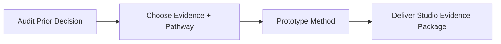

# Assignment Structure

The course is organized around **four major assignments** that move from reflection to action:

1. audit a prior decision
2. choose a pathway for the next one
3. prototype a method
4. deliver a studio-facing evidence package

The four assignments build on **one decision**: A2 plans the question A1 chose, A3 pilots the workflow A2 scoped, and A4 matures the A3 artifact into a decision-ready package. You never start over.

## Assignment Timeline

| Assignment | Due Week | Weight | Main question |
|---|---:|---:|---|
| [A1: Evidence Audit + Next Decision Brief](assignments/assignment-01.qmd) | Week 2 | 15% | What evidence did I really have before, and what evidence will I need next? |
| [A2: Evidence and Pathway Map](assignments/assignment-02.qmd) | Week 6 | 20% | Which sources and which workflow best fit my question? |
| [A3: Method Prototype](assignments/assignment-03.qmd) | Week 8 | 25% | Can I run a credible pilot workflow in my chosen pathway? |
| [A4: Studio Evidence Package](assignments/assignment-04.qmd) | Week 12 | 40% | Can I turn this workflow into a decision-ready studio brief? |

## The Three Primary Pathways

Every student surveys the broader tool landscape, but each student completes the semester through **one primary pathway**:

- **Spreadsheet**
- **GIS**
- **Python**

`BIM/BEM` and simulation remain important shared literacy, but they are taught as common supporting knowledge rather than as the required semester-long primary pathway.

## Mixed-Cohort Expectations

All students complete the same assignments. What changes by level is the expected **scope**, **rigor**, and **independence**.

| Level | Typical profile | Expected performance |
|---|---|---|
| Undergraduate | Newer to design research and tool workflows | Clear scope, honest use of simple methods, visible scaffolding |
| MArch | Closer to practice and studio decision-making | Stronger stakeholder fit, tighter argument, more independent judgment |
| PhD | Higher research maturity, sometimes stronger coding/statistics | More rigorous uncertainty treatment, stronger reproducibility, deeper method critique |

::: {.callout-note}
## Tiers Are Floors, Not Ceilings

The cohort tiers describe minimum expectations, not limits. Any student may opt into a higher tier's depth — stronger uncertainty treatment, more reproducible structure — without grade risk. "Tool overreach" means choosing a tool the question does not need. It never means depth within a tool the question does need.
:::

## Pathway Logic

### Spreadsheet

The baseline professional route.

- best when the question depends on comparison, summary, ranking, or accessible charting
- lowest setup burden
- fully legitimate as a complete semester pathway

### GIS

The spatial analysis route.

- best for site, access, zoning, morphology, environmental context, and map-based reasoning
- draws on the comparative GIS module: `QGIS`, `ArcGIS`, and `geopandas`
- may combine GUI work with notebook-based processing

### Python

The reproducible notebook route.

- best for students who need scripting, reuse, or slightly more complex analysis
- uses `Jupyter Notebook`
- supported through the existing beginner notebooks and small starter examples

## Assessment Philosophy

Students are not rewarded for choosing the most technically intimidating tool. They are rewarded for:

- selecting a pathway that fits the question
- being clear about assumptions and limits
- producing evidence someone else can follow
- communicating decisions without overclaiming

## Quality Standards Across All Assignments

Successful work, regardless of pathway, should show:

1. A specific design decision with a real audience
2. Evidence sources that are relevant and interpretable
3. A workflow that can actually be rerun or explained
4. Honest treatment of missing evidence and uncertainty
5. Visual and written communication that helps someone act

## Common Failure Modes

- choosing a tool because it looks advanced rather than because it fits
- confusing precedent images with evidence
- hiding weak data behind polished graphics
- making claims stronger than the method allows
- building a workflow no one, including the student, can rerun

## Assignment Progression

## Support Structure

- office hours for pathway-specific troubleshooting
- in-class reviews and feedback sessions
- notebook and setup support for GIS/Python students
- low-friction spreadsheet templates for students who need a stable baseline

For full instructions, rubrics, and deliverable requirements, use the assignment pages linked above.
