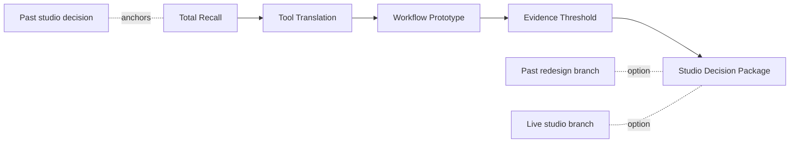

## Course Position

**ARCH7476** is a MArch-first elective about using generative and evidence-building workflows to make studio decisions more defensible.

The course starts from a simple premise:

> Your studio project is the case study. The course gives you a better workflow for one design decision inside it.

Students begin by reconstructing a past studio decision, then build a small workflow that can either redesign that past decision or support a current studio project.

::: {.hub-grid}
::: {.hub-card}
### Schedule
Twelve weeks, two-session classes, what is due when.
[Open schedule →](schedule.qmd)
:::
::: {.hub-card}
### Weekly Studio-Labs
The 12 decks: lecture + Session 2 round table.
[Start at Week 1 →](weeks_v2/week-01.qmd)
:::
::: {.hub-card}
### Assignments
A1 → A4, the cumulative package arc.
[See assignments →](assignments.qmd)
:::
::: {.hub-card}
### Resources
Templates, starter kits, the ML primer, and notebooks.
[Open the hub →](resources.qmd)
:::
:::

## The Semester Spine

## What Makes This Generative Design

The course treats generative design as a method, not a style.

In this course, **generative** means:

> a documented workflow that creates or varies multiple design options and evaluates them against explicit criteria.

Students learn to define:

- what can vary
- what must remain fixed
- what evidence can evaluate alternatives
- what threshold would change a design decision
- what workflow can be reused by another person

Supported workflow routes include:

| Workflow route | Typical design use |
|---|---|
| **Grasshopper / parametric workflow** | create and compare option families |
| **BIM/BEM and simulation literacy** | test performance assumptions across scenarios |
| **GIS / spatial workflow** | compare site or context alternatives |
| **Python / notebook workflow** | evaluate repeated design/data cases |
| **AI-assisted workflow building** | accelerate script or workflow components, then verify them |
| **Spreadsheet / low-code workflow** | compare variants, sensitivity, and thresholds transparently |

## Course Format

Each 2-hour class follows a **lecture + studio-lab** structure.

| Block | Time | Purpose |
|---|---:|---|
| Lecture / demo | first 50 minutes | one evidence or tooling lens |
| Studio-lab | second 50 minutes | apply that lens to each student's own project |

The second half is not generic work time. Each week provides prompts, desk crits, peer checks, and selected share-outs.

## A4 Branches

Students choose one final route by Week 6.

### Route A: Retrospective Redesign

Use a past studio project. Rebuild one design decision with better evidence and workflow logic.

### Route B: Live Studio Application

Use a current studio project. Apply the course workflow to one active design decision.

Both routes are assessed with the same standard:

> one design decision improved by one evidence-backed generative workflow.

## What Students Leave With

By the end of the semester, students will be able to:

1. Audit the evidence logic behind a studio decision.
2. Translate a design decision into variables, ranges, outputs, and thresholds.
3. Build one small generative workflow that creates or compares multiple variants.
4. Verify, document, and communicate the workflow without overclaiming.
5. Produce a practice-facing and research-facing decision package.

## Mixed-Cohort Expectations

The course is MArch-first, with a scaffolded route for undergraduates and a deeper method route for RPg/PhD students.

| Student level | Expected scope |
|---|---|
| Undergraduate | tightly bounded decision, scaffolded workflow, clear documentation |
| MArch | stronger studio/practice stakes, independent troubleshooting, actionable recommendation |
| RPg / PhD | deeper method critique, stronger uncertainty handling, reproducible analysis |

## Final Package

The final package includes:

- **Practice Case:** 2-slide decision memo
- **Research Brief:** 2-page method and evidence report
- **Object Card:** 1-page key figure and recommendation
- **Reproducibility Capsule:** README, data/workflow files, figure sources, prompt/code notes where relevant

## Archive Note

The 2025-26 offering has been preserved in `archive/2025-26-current-offering-source/`. Existing lectures, notebooks, and weekly decks are not deleted; they are reused or referenced where they support the rebuilt course spine.
