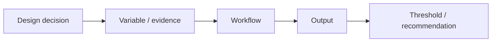

# Resource Logic

Use the lightest setup that can produce a credible workflow for your design decision.

The course does not reward technical intimidation. It rewards a clear relationship between:

::: {.hub-grid}
::: {.hub-card}
### Templates
Reusable worksheets for each assignment and weekly Session 2.
[Jump to templates →](#core-templates)
:::
::: {.hub-card}
### Starter Kits
Pathway starting points: GH, simulation, GIS, Python, AI, spreadsheet.
[Jump to starter kits →](#starter-kits)
:::
::: {.hub-card}
### ML Primer
The 12 Principles of ML for architecture, in plain language.
[Open the primer →](lectures/ml-primer-12-principles.qmd)
:::
::: {.hub-card}
### Lectures & Notebooks
ML-to-Python overview and the two analysis notebooks.
[Jump to supporting materials →](#lectures-and-supporting-materials)
:::
:::

## Core Templates

| Template | Use |
|---|---|
| [Project Reasoning Check-In](templates/project-reasoning-checkin.md) | weekly Session 2 Slack upload and round-table note |
| [Total Recall Board](templates/total-recall-board.md) | A1 past studio evidence audit |
| [Tool Translation Matrix](templates/tool-translation-matrix.md) | A2 workflow route comparison |
| [A4 Branch Declaration](templates/a4-branch-declaration.md) | Week 6 route and scope lock |
| [AI Workflow Verification Card](templates/ai-workflow-verification-card.md) | AI-assisted GH/Python/workflow documentation |
| [Final Package Checklist](templates/final-package-checklist.md) | A4 Practice Case, Research Brief, Object Card, Capsule |

## Starter Kits

Starter kits are tracked in [Starter Kits](starter_kits/README.md).

Launch-critical kits:

- [GH Parametric Variants](starter_kits/gh-parametric-variants/README.md)
- [Preset Simulation / Proxy Test](starter_kits/preset-simulation-proxy/README.md)
- [AI-Assisted Workflow](starter_kits/ai-assisted-workflow/README.md)

The rebuild should not be treated as student-ready until those three kits are runnable.

## Lectures and Supporting Materials

| Material | Use |
|---|---|
| [ML Primer · 12 Principles](lectures/ml-primer-12-principles.qmd) | plain-language ML mental model, skinned to the course visual language |
| [ML for Architecture — full deck (PDF)](data/ML_for_Architecture_Combined.pdf) | the detailed version: pipeline, diffusion, segmentation, surrogate modeling, GH/Honeybee tooling |
| [ML to Python Overview](lectures/ml-to-python-overview.qmd) | bridge from ML concepts to runnable Python |
| [Python + ML Basics](notebooks/01_python_ml_basics.ipynb) | starter notebook |
| [Architecture Viz + Analysis](notebooks/02_arch_viz_analysis.ipynb) | starter notebook |

## Supported Workflow Tracks

### GH / Parametric Workflow

Best when the decision depends on geometry variation or option families.

Typical outputs:

- GH definition
- exported variants
- parameter table
- comparison chart or object card

Current status: **needs new starter definitions and screenshots**.

### BIM/BEM and Simulation

Best when the decision depends on building performance, model translation, daylight, energy, facade logic, or environmental assumptions.

Typical outputs:

- model-translation critique
- preset simulation output
- sensitivity table
- performance threshold

Current status: **BIM/BEM lecture exists; preset simulation handout still needed**.

### GIS / Spatial Workflow

Best when the decision depends on site, access, zoning, context, exposure, or spatial comparison.

Typical outputs:

- map
- buffer/overlay output
- spatial summary table
- exported design criteria

Current status: **existing GIS material can be reused**.

### Python / Notebook Workflow

Best when the decision depends on repeated data analysis, visualization, or lightweight modeling.

Existing notebooks:

- `notebooks/01_python_ml_basics.ipynb`
- `notebooks/02_arch_viz_analysis.ipynb`

Current status: **existing notebooks can support optional code-heavy work**.

### AI-Assisted Workflow Building

Best when AI can help build a small workflow component, script, prompt sequence, or documentation scaffold.

Required documentation:

- prompt log
- generated output
- failure notes
- manual verification
- disclosure statement

Current status: **verification checklist template exists; concrete examples still needed**.

### Spreadsheet / Low-Code Workflow

Best when the decision depends on transparent comparison, sensitivity, or threshold logic.

Typical outputs:

- evidence table
- decision matrix
- sensitivity chart
- threshold statement

Current status: **existing spreadsheet logic can be reused as baseline support**.

## Setup Ladder

| Level | Setup |
|---|---|
| Everyone | Excel or Google Sheets, browser, PDF/image export |
| GIS route | QGIS, project layers, export workflow |
| Python route | Jupyter Notebook, Anaconda/Miniconda or Colab |
| GH route | Rhino + Grasshopper, supported plugins stated by instructor |
| Simulation route | preset tool selected for the class example |
| AI-assisted route | approved AI tool access, prompt log, verification notes |

## Archive and Reuse

The previous offering is preserved in:

`archive/2025-26-current-offering-source/`

High-value reusable materials:

- Week 1 evidence audit material
- Week 5 BIM/BEM deck
- GIS overview material
- Python and visualization notebooks
- object card / figure rescue content

Materials still needed:

- GH starter workflows
- preset simulation demo
- AI-assisted workflow examples
- final package templates in downloadable format
