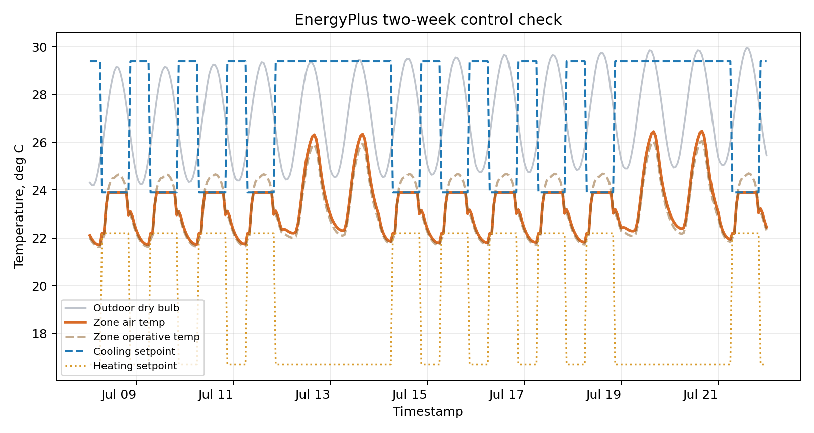

This is the optional EnergyPlus route for Week 5. It gives students one controlled performance-model run without asking them to build a full BEM model from scratch.

The launch-safe route is still the proxy script in this folder. Use this EnergyPlus case when EnergyPlus is already installed or when students want to test the actual CLI workflow.

## Why Run EnergyPlus Outside GH First?

This is not an argument against Grasshopper, Ladybug, or Honeybee. Those tools are useful design interfaces, and the output can still be patched back into GH later.

The direct CLI run is a visibility exercise. It lets students inspect the model file, weather file, run period, thermostat setpoints, output variables, warnings, and CSV outputs before adding another translation layer. That reduces uncertainty while students learn what the simulator actually did.

## What This Demonstrates

The case does four things:

1. finds the local EnergyPlus installation
2. copies the stock `5ZoneAirCooled.idf` example model
3. patches it to run only a two-week summer period
4. extracts monitored hourly outputs and thermostat setpoints to a clean CSV

The point is not to prove a design. The point is to show what must be inspected before a simulation result becomes evidence.

## Install EnergyPlus

Use the official EnergyPlus download/release pages:

- <https://energyplus.net/downloads>
- <https://github.com/NREL/EnergyPlus/releases>

After installing, open the installation folder and identify:

| Folder / file | Why it matters |
|---|---|
| `energyplus` or `energyplus.exe` | command-line simulator |
| `Energy+.idd` | object schema for the installed version |
| `ExampleFiles/` | testable models that ship with the installer |
| `WeatherData/` | sample EPW weather files |
| `PostProcess/` | output conversion helpers used by EnergyPlus |

## One EnergyPlus Command

The raw CLI pattern is the same on macOS and Windows:

```bash
energyplus -w path/to/weather.epw -d outputs -p two_week -r path/to/model.idf
```

| Flag | Meaning |
|---|---|
| `-w` | EPW weather file |
| `-d` | output folder |
| `-p` | output file prefix |
| `-r` | run post-processing so CSV outputs are easier to inspect |

## Cross-Platform Class Runner

From this starter-kit folder:

```bash
python run_energyplus_two_week_case.py
```

The script first tries to find `energyplus` from your system `PATH`. If that fails, set `ENERGYPLUS_EXE`.

macOS:

```bash
export ENERGYPLUS_EXE="/Applications/EnergyPlus-26-1-0/energyplus"
python run_energyplus_two_week_case.py
```

Windows PowerShell:

```powershell
$env:ENERGYPLUS_EXE="C:\EnergyPlusV26-1-0\energyplus.exe"
python run_energyplus_two_week_case.py
```

If your installed folder name is different, change only the path.

## What The Script Creates

```text
work/energyplus_two_week/
  synthetic_hk_summer.epw
  two_week_model.idf

outputs/energyplus_two_week/
  monitored_outputs.csv
  monitored_outputs.png
  two_week_summary.txt
```

The script generates a synthetic Hong Kong-like summer EPW so the class run is reproducible. It then copies the installed `5ZoneAirCooled.idf` stock example and appends monitoring outputs:

- outdoor dry-bulb temperature
- zone mean air temperature
- zone operative temperature, if available
- thermostat cooling setpoint
- thermostat heating setpoint
- cooling rate, if available

## Preview Output

The published chart below is a checked local EnergyPlus run using the generated synthetic weather and the installed `5ZoneAirCooled.idf` stock example model. Your local EnergyPlus run will overwrite the live output files.



Published checked outputs:

- [monitored output CSV](outputs/energyplus_two_week/monitored_outputs.csv)
- [run summary](outputs/energyplus_two_week/two_week_summary.txt)

| What to inspect | Why |
|---|---|
| first and last timestamp | confirms the model ran only the intended two-week period |
| outdoor temperature | confirms the weather file was read |
| zone air and operative temperature | shows the thermal response of the example model |
| heating/cooling setpoints | shows what the control system was trying to do |
| cooling rate | shows when the system acted, but should not share the temperature axis |
| error/warning file | shows whether the result is trustworthy enough to discuss |

## Student Adaptation

For A2/A3, students may adapt the EnergyPlus route by changing one controlled input:

- run period
- weather file
- window-to-wall ratio in the example model
- shading assumption
- schedule assumption
- output variable

Only change one or two inputs at first. A small reproducible run with a clear assumption is stronger than a complicated model no one can inspect.

## Verification Questions

- Which file was the model?
- Which file was the weather?
- Which run period did you actually simulate?
- Which output variable are you reading?
- What were the heating and cooling setpoints?
- Which assumption would most likely change the result?
- What warning or limitation would you report before using the output as evidence?
