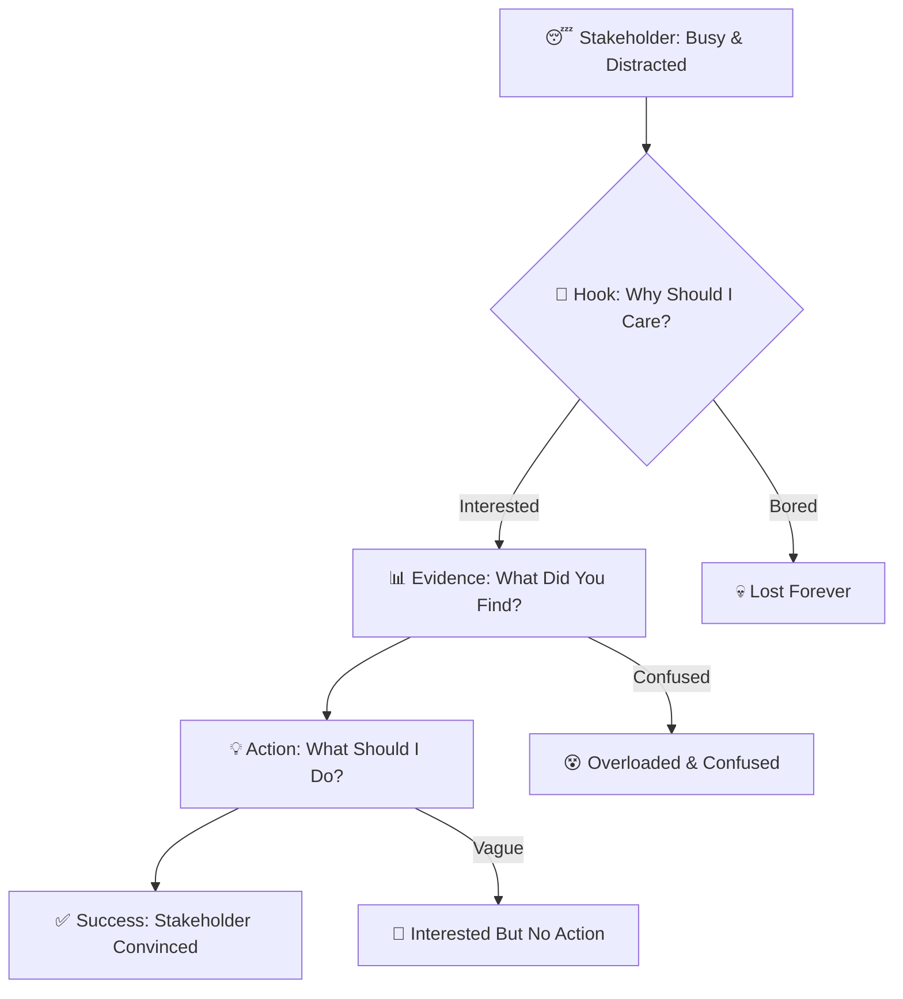
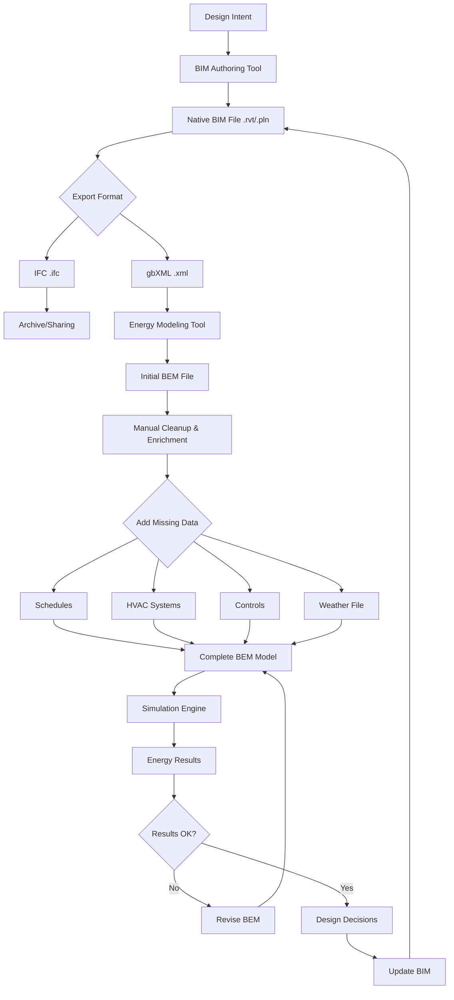

## 🎬 Welcome to the Story Wars! {.center}

::: {.callout-important icon=false}
## Today's Epic Battle: Who Tells the Best Story?

**The Ultimate Challenge**: Transform your semester of hard work into a story so compelling that busy decision-makers will stop scrolling social media to listen

**The Weapons**: Two slides, killer visuals, and narrative superpowers

**The Stakes**: Professional credibility, stakeholder buy-in, and Object Fair domination
:::

**🏆 Today's Championship Events:**

🎭 **Story Structure Showdown** | 📊 **Figure Design Olympics** | 🎤 **Elevator Pitch Battle Royale** | 👥 **Peer Review Arena** | 🎨 **Object Card Design Wars**

---

# Round 1: The Great Story Disasters {background-color="#8B0000"}

---

## 💀 When Good Research Goes Bad (Story Edition)

**Before we become storytelling champions, let's learn from the narrative graveyard...**

::: {.callout-warning icon=false}
## Real-World Presentation Disasters

**🏢 Case 1: The $50M Miscommunication**

- PhD researcher presents brilliant energy analysis to Hong Kong developer board
- **45 minutes** of technical methodology explanation
- **30 seconds** on what this means for their bottom line
- **Board's response**: "Interesting... but what should we actually DO?"
- **Result**: No adoption, project shelved, researcher never invited back

**📊 Case 2: The Chart Catastrophe**

- Consultant shows 47 different charts to planning committee
- **Every chart** technically perfect, statistically sound
- **No chart** tells decision-makers what action to take
- **Committee response**: "We're more confused than when we started"
- **Result**: Status quo wins, innovative solution dies
:::

**🤔 Reality Check**: How many of your presentations focus more on HOW you did it than WHY anyone should care?

---

## 🎯 The Two-Slide Death Match

**⚡ The challenge**: Distill your ENTIRE semester into exactly 2 slides that would make a busy stakeholder stop what they're doing and take action

::: {.callout-note icon=false}
## Battle Stations: Choose Your Story Structure

**Move to corners of the room based on your current approach:**

**🔥 Action Corner**: "I start with what they should DO"

**📊 Evidence Corner**: "I start with what I FOUND"

**😰 Problem Corner**: "I start with what's WRONG"

**🤷 Confusion Corner**: "I honestly have NO IDEA how to start"

**3 minutes to convince other corners why YOUR approach wins!**
:::

**Plot twist**: We'll test which structure actually WORKS with real stakeholders!

---

## 🎬 The Story Structure Science

**🧠 Cognitive Science Reality**: Human brains process stories in predictable patterns

**⏰ You have 15 seconds** to grab attention or lose them forever!

---

# Round 2: BIM & BEM Fundamentals - The Data Behind the Buildings {background-color="#4B0082"}

---

## 🏗️ What Are BIM and BEM?

**Understanding the two critical data ecosystems in modern architecture**

::: {.callout-note icon=false}
## Building Information Modeling (BIM)

**Definition**: A digital representation of physical and functional characteristics of a building

**Primary Purpose**: Design, construction, and facility management

**Key Focus**: Geometry, materials, spatial relationships, construction sequences

**Primary Users**: Architects, engineers, contractors, facility managers

**Typical File Formats**: IFC (.ifc), Revit (.rvt), ArchiCAD (.pln), gbXML (.xml)
:::

::: {.callout-note icon=false}
## Building Energy Modeling (BEM)

**Definition**: A computational representation of a building's energy flows and thermal behavior

**Primary Purpose**: Energy performance analysis, optimization, and compliance

**Key Focus**: Thermal zones, HVAC systems, schedules, weather data, energy consumption

**Primary Users**: Energy analysts, sustainability consultants, MEP engineers

**Typical File Formats**: EnergyPlus (.idf), OpenStudio (.osm), eQuest (.inp), TRNSYS (.dck)
:::

---

## 📊 The BIM Data Structure

**How is geometric and construction information actually organized?**

### 🏛️ Hierarchical Organization

**Building Information Models follow a structured hierarchy:**

- **Project** → Contains all building information
  - **Site** → Location, orientation, context
    - **Building** → One or more structures
      - **Stories/Levels** → Floor-by-floor organization
        - **Spaces/Rooms** → Individual zones
          - **Building Elements** → Walls, floors, windows, doors
            - **Components** → Materials, layers, properties
              - **Properties** → Thermal, structural, cost data

### 🔗 Key BIM Data Components

**1. Geometry**

- 3D coordinates and shapes
- Parametric relationships (walls connect to floors)
- Topological connections between elements

**2. Attributes**

- Material properties (conductivity, density, specific heat)
- Construction details (layer thickness, assembly type)
- Performance data (R-values, U-values, SHGC)

**3. Relationships**

- Spatial containment (window within wall)
- Connections (wall joins floor)
- Systems (window part of exterior envelope system)

---

## ⚡ The BEM Data Structure

**How is energy performance actually calculated?**

### 🌡️ Zone-Based Organization

**Energy models organize buildings by thermal zones, not just geometry:**

- **Building** → Overall energy system
  - **Thermal Zones** → Spaces with similar thermal behavior
    - **Surfaces** → Walls, roofs, floors (heat transfer boundaries)
      - **Constructions** → Material layers with thermal properties
    - **Internal Loads** → People, lights, equipment
    - **HVAC Systems** → Heating, cooling, ventilation
    - **Schedules** → Occupancy, equipment usage patterns
  - **Site Context**
    - **Weather Data** → Hourly temperature, solar radiation, wind
    - **Shading** → Adjacent buildings, landscape

### 📈 Critical BEM Data Elements

**1. Thermal Zones**

- Volume and floor area
- Thermostat setpoints (heating/cooling)
- Ventilation requirements

**2. Constructions**

- Material layers (inside → outside)
- Thermal resistance of each layer
- Thermal mass and heat capacity

**3. Schedules**

- Occupancy patterns (hourly, daily, seasonal)
- Equipment operation times
- Lighting schedules

**4. Systems**

- HVAC equipment types and efficiencies
- Distribution systems (ductwork, pipes)
- Control strategies

---

## 🔄 Quick Check: BIM vs BEM Thinking

**💡 5-Minute Partner Challenge**

**Scenario**: You're modeling a south-facing office with a large window.

**Question 1**: What would a BIM model care about?

- A) Window size, frame material, glass type, cost
- B) Solar heat gain coefficient, U-value, thermal mass
- C) Both equally
- D) Neither - just the visual appearance

**Question 2**: What would a BEM model care about?

- A) Exact window manufacturer and product code
- B) Window thermal properties and solar transmission
- C) Construction sequencing and installation method
- D) Visual aesthetics and daylighting quality

**Question 3**: Which model needs to know about occupancy schedules?

- A) BIM only
- B) BEM only
- C) Both
- D) Neither

**🎯 Discuss answers with partner - we'll reveal the correct answers and why they matter!**

---

## ✅ Quick Check Answers

**Question 1**: **A** - BIM cares about physical/construction properties

- BIM focuses on what to build and how to build it
- Material specifications, dimensions, costs, constructability

**Question 2**: **B** - BEM cares about thermal/energy properties

- BEM focuses on how the building performs energetically
- Heat flows, solar gains, thermal resistance matter for energy calculations

**Question 3**: **B** - BEM needs schedules for energy calculations

- BIM might document space programs, but doesn't need hourly schedules
- BEM requires schedules to calculate time-varying energy use

**🤔 Key Insight**: Same building, completely different data priorities!

---

# Round 3: Figure Design Olympics {background-color="#006400"}

---

## 🎨 The Visualization Gladiator Arena

**🏆 Championship Categories:**

### 📊 **Speed Chart Challenge** (10 minutes)
Transform this terrible chart into presentation gold!

*[Show intentionally awful chart: cluttered, unclear, no message]*

**Rules**: Same data, maximum impact, stakeholder-friendly

### 🎯 **Message Clarity Championships** (15 minutes) 
Create a figure where the key insight is obvious in **3 seconds**

### 🔥 **Uncertainty Communication Olympics** (12 minutes)
Show confidence levels without confusing non-experts

### 💎 **Professional Polish Finals** (18 minutes)
Make one figure so beautiful it could be in Harvard Business Review

---

## ⚡ Speed Chart Battle Royale

**🚨 Current Disaster**: 

**Problems with this chart:**
- 47 different data series (seriously!)
- No clear message or takeaway
- Tiny text, confusing colors
- Overwhelming for stakeholders

**⏰ 10-minute transformation challenge!**

::: {.callout-tip icon=false}
## Speed Chart Rescue Formula

1. **One Message Rule**: What's the ONE thing stakeholders need to know?
2. **3-Second Test**: Key insight obvious immediately?
3. **Annotation Strategy**: Use text to guide interpretation
4. **Color Purpose**: Every color choice supports the message
5. **Context Connection**: How does this relate to stakeholder decisions?
:::

**🏆 Judging**: Present your transformation in 60 seconds!

---

## 🎯 The 3-Second Message Test

**🧠 Brain Science**: Stakeholders form first impressions in 3 seconds

**Challenge**: Create figures that pass the "conference coffee break test"

*Scenario: Busy stakeholder walks past your poster with coffee, glances for 3 seconds while walking. Do they "get it"?*

### 🏃 Live Testing Protocol

1. **Create your figure** (10 minutes)
2. **Speed dating rounds** (30 seconds each):
   - Show figure to classmate for exactly 3 seconds
   - They write down what they understood
   - Compare to your intended message
3. **Iterate rapidly** based on feedback
4. **Championship round**: Best 3-second clarity wins!

::: {.callout-warning}
## Common 3-Second Failures

❌ **Chart Title**: "Analysis of Building Performance Metrics Across Various Scenarios"

✅ **Chart Title**: "South-facing offices need blinds to prevent glare"

❌ **Chart Message**: Hidden in data, requires interpretation

✅ **Chart Message**: Annotated, highlighted, impossible to miss
:::

---

## 📐 Professional Polish Transformation Lab

**🎨 Design Clinic Format**: 5-minute individual consultations while others work

**Bring your WORST figure** (we all have one!) for emergency makeover:

### 🚑 Figure Emergency Room

**Triage Categories:**

**🔴 Critical**: Completely incomprehensible, multiple fatal errors
**🟡 Urgent**: Technically correct but unprofessional presentation  
**🟢 Stable**: Good content, needs minor polish for Object Fair

**Treatment Plans:**

- **Typography therapy**: Font hierarchy, readability, professionalism
- **Color surgery**: Strategic use, accessibility, brand consistency  
- **Layout operation**: White space, alignment, visual flow
- **Message transplant**: Clear communication of key insights

::: {.callout-success}
## Before/After Showcase

**Share your transformation!**

- 30 seconds: Show before version (no shame, we've all been there!)
- 30 seconds: Reveal after version
- 30 seconds: Explain what changed and why it works better

**Vote**: Most dramatic improvement wins the "Phoenix Award" 🔥→🦋
:::

---

# Round 4: From Design to Data - BIM/BEM File Generation {background-color="#FF4500"}

---

## 🔨 Where Do These Files Come From?

**Understanding the complete workflow from design intent to energy analysis**

### 🏗️ The BIM Generation Pathway

**1. Manual Creation (Traditional BIM authoring)**

- **Origin**: Designer creates geometry in BIM software (Revit, ArchiCAD, etc.)
- **Process**:
  - Draw walls, place windows, define materials
  - Assign properties and parameters
  - Organize into spaces and systems
- **Output**: Native BIM file (.rvt, .pln) or neutral format (IFC)
- **Pros**: Full design control, rich detail, integrated workflow
- **Cons**: Time-intensive, requires BIM expertise, manual updates

**2. 3D Model Import and Enrichment**

- **Origin**: Import from other 3D tools (SketchUp, Rhino, etc.)
- **Process**:
  - Import geometry as "dumb" 3D shapes
  - Add semantic information (this surface is a wall, not just a polygon)
  - Assign materials and properties
- **Output**: Enriched BIM model
- **Pros**: Leverages existing 3D models, design freedom
- **Cons**: Requires significant cleanup and semantic tagging

**3. Point Cloud and Reality Capture**

- **Origin**: 3D scanning of existing buildings
- **Process**:
  - Laser scan or photogrammetry creates point cloud
  - Convert points to BIM geometry (walls, floors, etc.)
  - Estimate materials and conditions
- **Output**: As-built BIM model
- **Pros**: Accurate existing conditions, useful for renovations
- **Cons**: Estimates required for hidden properties, labor-intensive

---

## ⚡ The BEM Generation Pathway

**How do we get from buildings to energy models?**

### 🔄 Primary Generation Methods

**1. BIM-to-BEM Translation (Automated)**

- **Origin**: Existing BIM model
- **Process**:
  - Export BIM to gbXML or IFC format
  - Import into energy modeling tool (OpenStudio, eQuest, etc.)
  - Software automatically:
    - Identifies thermal zones from spaces
    - Extracts surface geometry and constructions
    - Assigns default schedules and systems
- **Output**: Initial BEM file (.idf, .osm, .inp)
- **Pros**: Fast, leverages existing BIM work, reduces duplication
- **Cons**: Often requires extensive cleanup, missing critical energy data

**2. Direct Energy Model Creation (Manual)**

- **Origin**: Design documents, specifications, or simplified geometry
- **Process**:
  - Energy analyst creates simplified geometric model
  - Manually defines thermal zones (often simplified from actual rooms)
  - Assigns detailed schedules, systems, and controls
- **Output**: Purpose-built BEM file
- **Pros**: Energy-focused, appropriate level of detail, analyst control
- **Cons**: Disconnected from BIM, duplicate effort, manual updates

**3. Template-Based Modeling**

- **Origin**: Building archetype or prototype model
- **Process**:
  - Start with reference model (office building template, etc.)
  - Modify geometry to match actual design
  - Adjust systems and schedules for project specifics
- **Output**: Customized BEM from template
- **Pros**: Fast, proven assumptions, reduced errors
- **Cons**: May not capture unique design features, less accurate for unusual buildings

---

## 🗺️ The Complete BIM/BEM Workflow Map

**Real-world data flow in an integrated building project**

---

## 📝 The Critical "Translation Gap" Problem

**What gets lost when converting BIM → BEM?**

### ❌ Commonly Missing or Wrong After Translation

**Geometry Issues:**

- **Simplified too much**: Curved facades become straight walls
- **Simplified too little**: Every door frame exported as thermal zone
- **Wrong orientation**: Building rotates during export
- **Missing context**: Adjacent buildings and shading lost

**Thermal Zoning Problems:**

- **BIM spaces ≠ Thermal zones**: Conference room divided into 4 spaces in BIM exports as 4 zones
- **Open plans fail**: Open office should be one zone, exports as dozens
- **Missing plenum zones**: Return air paths not captured

**Material/Construction Gaps:**

- **Generic assignments**: "Exterior wall" without actual layers or R-value
- **Missing internal mass**: Furniture, partition walls, structural mass ignored
- **No thermal bridges**: Connections and penetrations simplified

**Operational Data Missing:**

- **No schedules**: BIM doesn't know when lights turn on or off
- **No HVAC systems**: BIM has architectural spaces, not mechanical systems
- **No controls**: Thermostat strategies, sensor locations absent
- **No set points**: Heating/cooling temperatures undefined

### ✅ What Translates Well

**Basic geometry** (walls, floors, windows), **surface areas**, **window-to-wall ratios**, **orientation**, **building footprint**

---

## 🎯 Hands-On: Translation Detective Challenge

**⏰ 10-Minute Group Activity**

**Scenario**: You've exported a BIM model to gbXML and opened it in an energy modeling tool. The initial results show the building uses **3× more energy** than expected!

**Your Mission**: Identify what likely went wrong in the translation.

**Given Information:**

- Building: 5-story office building with open floor plan
- BIM model: Very detailed architectural model with every furniture piece modeled
- Translation: Automated gbXML export with default settings
- BEM result: 450 kWh/m²/year (expected: 150 kWh/m²/year)

**Detective Questions:**

1. How many thermal zones do you think were created? (Hint: Think about all those furniture pieces and room divisions)

2. What might be wrong with the HVAC system in the energy model?

3. What schedules are likely being used?

4. What's probably missing that would reduce the energy use?

**🎯 Groups report out findings - let's debug this together!**

---

# Round 5: BIM-BEM Interoperability - The Integration Challenge {background-color="#800080"}

---

## 🔗 Why Can't BIM and BEM Just Talk to Each Other?

**The fundamental challenge: Two models, same building, completely different purposes**

### 🤔 The Core Problem

**BIM and BEM are optimized for different questions:**

**BIM asks**: "What do we build and how?"

- Detailed geometry for construction
- Material specifications for procurement
- Cost data for budgeting
- Schedule for sequencing

**BEM asks**: "How will it perform energetically?"

- Simplified geometry for calculation speed
- Thermal properties for heat flow
- Operational assumptions for usage patterns
- Weather data for climate response

**🎯 The conflict**: Detail needed for construction ≠ Detail needed for energy analysis

---

## 🌉 The Translation Bridges: IFC vs gbXML

**Two competing standards for BIM-to-BEM data exchange**

::: {.callout-note icon=false}
## IFC (Industry Foundation Classes)

**Created by**: buildingSMART International (1990s)

**Primary Purpose**: Comprehensive BIM data exchange across all disciplines

**Scope**: Entire building lifecycle (design, construction, operation, demolition)

**Energy Focus**: Originally minimal, gradually improving with "MVDs" (Model View Definitions)

**Strengths:**

- Vendor-neutral, open standard
- Comprehensive building information
- Well-established in architecture and construction
- Supports complex geometric relationships

**Weaknesses for Energy:**

- Too much information (slow to process)
- Energy-specific data often missing or inconsistent
- Thermal zoning unclear or wrong
- HVAC systems poorly defined for energy analysis

**Common Use**: Archiving, collaboration between architects/engineers/contractors
:::

::: {.callout-note icon=false}
## gbXML (Green Building XML)

**Created by**: Green Building XML Schema Inc. (2000)

**Primary Purpose**: Specifically for BIM-to-energy model translation

**Scope**: Building geometry, materials, and context for energy analysis

**Energy Focus**: Designed explicitly for energy simulation tools

**Strengths:**

- Purpose-built for energy analysis
- Cleaner thermal zone definitions
- Faster to process than IFC
- Better support for HVAC system basics

**Weaknesses:**

- Limited to energy analysis (not full BIM)
- Vendor implementations inconsistent
- Less detailed than IFC for construction
- Proprietary governance (less open than IFC)

**Common Use**: Exporting from Revit/ArchiCAD to OpenStudio/eQuest/IES-VE
:::

---

## 📊 IFC vs gbXML: Head-to-Head Comparison

| Feature | IFC | gbXML | Winner |
|---------|-----|-------|--------|
| **Geometric Accuracy** | Very high (construction-grade) | Medium (energy-grade) | IFC |
| **Thermal Zone Definition** | Poor (not its focus) | Good (designed for this) | gbXML |
| **Material Properties** | Comprehensive (but not thermal) | Thermal-focused | gbXML |
| **HVAC Systems** | Detailed (but not for energy calc) | Simplified (but usable) | gbXML |
| **File Size / Speed** | Large, slow | Smaller, faster | gbXML |
| **Industry Adoption (BIM)** | Very high | Medium | IFC |
| **Industry Adoption (Energy)** | Growing | High | gbXML |
| **Open Standard** | Yes (buildingSMART) | Semi-open | IFC |

**🎯 Reality Check**: Neither is perfect! Most workflows require manual cleanup after translation.

---

## 🛠️ How Models Stay Updated (Or Don't!)

**The lifecycle synchronization challenge**

### 🔄 The Ideal World (Rarely Achieved)

**Single Source of Truth:**

1. **Design in BIM** → Update geometry, materials, systems
2. **Auto-export to BEM** → Translation with minimal manual fixes
3. **Run energy simulation** → Get performance results
4. **Design iteration** → Make changes in BIM
5. **Repeat** → BEM automatically updates

**Why this rarely works:**

- Translation errors require manual BEM fixes
- Manual fixes get overwritten on next export
- BIM and BEM diverge over project lifecycle
- No clear "version control" between models

### 😰 The Real World (More Common)

**Divergent Models:**

1. **Initial BIM** → Create architectural model
2. **Export to BEM** → One-time translation
3. **Manual BEM refinement** → Energy analyst fixes zones, adds schedules/systems
4. **BIM continues evolving** → Architect makes design changes
5. **BEM frozen** → Energy model not updated (too much manual work to redo)
6. **Final disconnect** → As-built BIM ≠ Energy model used for analysis

**Consequences:**

- Energy performance predictions may not match as-built reality
- Difficulty tracking which design changes were analyzed
- Wasted effort recreating models
- Compliance documentation doesn't match construction

### 🔧 Current Industry Approaches

**Approach 1: Periodic Re-synchronization**

- Major design milestones trigger new BIM → BEM export
- Energy analyst maintains spreadsheet of manual adjustments
- Reapply manual fixes to new export (tedious but doable)

**Approach 2: Parallel Development**

- Maintain BIM and BEM separately
- Use BIM as reference, manually update BEM geometry
- Treat them as related but independent models

**Approach 3: BEM-First Simplification**

- Create simplified "energy massing model" early
- Use this for energy analysis throughout project
- Accept that it won't match detailed BIM exactly

---

## 🎯 Case Study: When Translation Goes Wrong

**Real project example** (anonymized)

### 📋 The Setup

**Project**: New university research building, 6 stories, 15,000 m²

**BIM Tool**: Revit (architectural model with MEP coordination)

**Energy Tool**: OpenStudio/EnergyPlus

**Goal**: LEED Gold certification, energy modeling required

### 💥 What Happened

**Week 1**: Architect exports Revit model to gbXML

- File exports successfully
- OpenStudio imports without errors
- Team celebrates "seamless interoperability"

**Week 2**: Energy analyst reviews imported model

- **465 thermal zones** created (expected: ~30)
  - Every small space (closets, corridors) became separate zone
  - Open office areas fragmented into dozens of zones
- **No HVAC systems** defined (all zones "unconditioned")
- **Generic wall constructions** (no R-values, all same type)
- **Window properties missing** (no SHGC, U-value, or visible transmittance)
- **Building rotated 90 degrees** (orientation error)

**Week 3-4**: Manual cleanup required

- Manually merge zones (465 → 32)
- Research and input all construction assemblies
- Define HVAC systems from MEP drawings
- Create occupancy and equipment schedules
- Fix orientation and add context shading
- **Time spent**: 40+ hours

**Week 8**: Architect makes design changes

- Window sizes change
- Interior walls move
- Roof design modified

**Dilemma**: Re-export and lose 40 hours of work? Or manually update BEM?

**Solution**: Manual updates to BEM, document discrepancies, hope nothing major changes again

### 🤔 Lessons Learned

**What went wrong:**

1. Default gbXML export settings inappropriate for energy modeling
2. BIM not created with energy analysis in mind
3. Missing data not flagged until after export
4. No workflow for managing updates

**What should have happened:**

1. Pre-export BIM cleanup (consolidate spaces for thermal zones)
2. Define construction assemblies in BIM before export
3. Coordinate with MEP for HVAC system info
4. Plan for iterative updates with version control

---

## 🎮 Hands-On Challenge: BIM-BEM Divergence Detective

**⏰ 12-Minute Group Activity**

**Scenario**: You're consulting on a project where the energy model and BIM have diverged. The facility manager reports actual energy use is **30% higher** than the energy model predicted. Time to investigate!

**Given Information:**

- **BIM Model** (as-built): Updated through construction, includes all changes
- **Energy Model**: Based on Design Development stage, not updated after schematic
- **Time Gap**: 14 months between energy model freeze and building operation

**Your Mission**: For each category, identify what likely diverged and WHY it matters for energy performance.

### 🔍 Investigation Categories

**1. Geometry Changes**

- What building features might have changed during design development/construction?
- Which changes would significantly affect energy use?

**2. Construction/Materials**

- What "value engineering" commonly happens during construction?
- How would this affect thermal performance?

**3. Systems**

- How might the actual HVAC differ from what was modeled?
- What controls or sequences might have changed?

**4. Operations**

- What operational assumptions might not match reality?
- What schedules or usage patterns might differ?

**🎯 Groups present their top 3 divergence suspects and impact on energy performance!**

---

# Round 6: Object Card Design Wars {background-color="#DC143C"}

---

## 🎨 The Ultimate Visual Communication Challenge

**🏆 Mission**: Create a poster so compelling that people fight over who gets to work with you

### ⚡ The 30-Second Poster Test

**Scenario**: Object Fair networking break. Stakeholder walks past your poster with coffee and phone. You have 30 seconds to make them:

1. **Stop walking** (3 seconds)
2. **Read your message** (15 seconds)  
3. **Take action** (contact you, ask questions, offer collaboration)

### 🎯 Design Challenge Rounds

**Round 1: Message Hierarchy** (10 minutes)
- One clear message dominates the design
- Supporting evidence visible but secondary
- Contact/action information findable but not cluttered

**Round 2: Visual Impact** (15 minutes)
- Compelling from 6 feet away (networking distance)
- Professional quality suitable for career portfolio
- Memorable enough to be recognized later

**Round 3: Stakeholder Test** (12 minutes)
- Works for multiple stakeholder types
- Language appropriate for non-experts
- Action items clear and specific

---

## 🔥 Live Design Laboratory

### 🚨 Current Object Card Emergency Room

**Triage your existing design:**

**🟢 Green Zone**: Professional quality, clear message, ready for Object Fair
**🟡 Yellow Zone**: Good content, needs design polish and clarity improvement
**🔴 Red Zone**: Complete redesign needed, unclear message, unprofessional appearance

### ⚡ Speed Design Clinic

**15-minute individual consultations** while others work:

**Bring**: Current Object Card draft (any stage)
**Get**: Specific design feedback and rapid improvement strategies
**Focus**: Maximum impact changes for minimum time investment

::: {.callout-tip icon=false}
## Object Card Success Formula

**🎯 Message Dominance**: 
- ONE key finding/recommendation as hero
- Everything else supports this message
- 3-second understanding test

**👁️ Visual Hierarchy**:
- Size, color, position guide attention
- Most important = biggest, boldest, best position
- Less important = smaller, neutral, secondary position

**🎨 Professional Polish**:
- Consistent fonts, colors, spacing
- High-quality images and graphics
- Print-test at actual size

**📞 Action Orientation**:
- Clear contact information
- Specific next steps for interested stakeholders
- Memorable personal branding
:::

---

## 🏆 Object Card Championship Judging

### 📊 Live Voting Categories

**Vote with phones for real-time results:**

| Category | Winner | Why They Won |
|----------|--------|--------------|
| **🎯 Clearest Message** | ? | ? |
| **👁️ Best Visual Impact** | ? | ? |
| **💼 Most Professional** | ? | ? |
| **🤝 Most Stakeholder-Friendly** | ? | ? |
| **🔥 Most Memorable** | ? | ? |

### 🎪 Hall of Fame Gallery

**Photo documentation of winning strategies:**

- **Message hierarchy examples**: How winners made key points dominant
- **Visual impact techniques**: Color, layout, typography strategies
- **Professional polish details**: What separates good from great
- **Stakeholder-friendly language**: How to communicate without jargon

---

# Final Boss Challenge: Why Are BIM & BEM Different? {background-color="#B8860B"}

---

## 🧩 The Ultimate Integration Question

**Why can't we just have ONE model that does everything?**

**Think about it**: We have the technology to model buildings in extraordinary detail. We can simulate physics, manage construction, track costs, coordinate trades. So why do we maintain separate BIM and BEM models?

### 🎯 Group Challenge: Defend or Critique

**⏰ 15-Minute Structured Debate**

**Split into three positions:**

### 🔵 Team "Unified Model"

**Argument**: "We SHOULD combine BIM and BEM into one integrated model"

**Your job:**

- Argue benefits of single source of truth
- Explain how technology could bridge the gap
- Propose what a unified model would look like
- Address efficiency and workflow improvements

### 🔴 Team "Separate Forever"

**Argument**: "BIM and BEM MUST remain separate specialized tools"

**Your job:**

- Argue why different purposes require different tools
- Explain computational and practical limitations
- Defend current industry practice
- Address why integration attempts fail

### 🟡 Team "Hybrid Future"

**Argument**: "We need BETTER integration, not full unification"

**Your job:**

- Propose specific improvements to current workflow
- Identify what should be shared vs. what should remain separate
- Design realistic interoperability enhancements
- Balance idealism with practical constraints

---

## 🔬 The Fundamental Differences Revealed

**After the debate, let's examine the core reasons BIM ≠ BEM:**

### 1️⃣ **Computational Complexity**

**BIM Priority**: Visual accuracy, construction detail, documentation clarity

- Can handle millions of polygons
- Focuses on representing what you see
- Rendering speed matters more than calculation speed

**BEM Priority**: Simulation speed, numerical stability, annual calculations

- Must run 8,760 hours of calculations
- Simplified geometry = faster simulation
- Trade visual accuracy for computational efficiency

**💡 Key Insight**: A photorealistic model with every screw and bolt is useless for energy analysis if it takes 40 hours to simulate one design option.

### 2️⃣ **Temporal Resolution**

**BIM**: Mostly static snapshot

- Documents building at specific design phases
- Changes tracked as versions, not continuous time
- Doesn't model how building operates over time

**BEM**: Inherently time-dynamic

- Simulates every hour of the year (8,760 timesteps)
- Models changing weather, occupancy, solar angles
- Captures thermal mass, system cycling, seasonal variation

**💡 Key Insight**: BIM says "this is the wall," BEM says "this is how the wall performs differently at 2am in January vs. 2pm in July"

### 3️⃣ **Data Precision vs. Assumptions**

**BIM**: Strives for precision and specification

- Exact dimensions (150mm thick wall, not ~150mm)
- Specific products (Brand X window, Model 123)
- As-specified or as-built documentation

**BEM**: Embraces necessary assumptions

- Typical occupancy patterns (not actual future behavior)
- Representative weather data (not next year's actual weather)
- Estimated operation (not guaranteed user behavior)

**💡 Key Insight**: BIM pretends to certainty (we will build this). BEM acknowledges uncertainty (we predict this will probably happen).

### 4️⃣ **Geometry Philosophy**

**BIM**: Parametric, relationship-based, construction-logical

- Walls connect to floors at specific relationships
- Changes propagate through dependencies
- Maintains constructability rules

**BEM**: Thermal boundary-based, physics-logical

- Surfaces define heat flow boundaries
- Zones organized by thermal similarity, not construction
- Maintains energy balance requirements

**💡 Key Insight**: BIM thinks in building elements (wall, window, door). BEM thinks in heat transfer surfaces (opaque boundary, transparent boundary, internal partition).

---

## 🏆 The Synthesis: When Should They Align?

**Critical Alignment Points** (where BIM and BEM MUST match):

✅ **Basic geometry** (footprint, height, orientation, major massing)

✅ **Envelope areas** (total wall area, window area, roof area)

✅ **Material thermal properties** (U-values, SHGC for specified assemblies)

✅ **Space programs** (square footage by use type)

**Acceptable Divergence Points** (where differences are necessary):

⚠️ **Thermal zoning** (BEM zones ≠ BIM spaces)

⚠️ **Geometric detail** (BEM simplified, BIM detailed)

⚠️ **Systems representation** (BEM parametric, BIM documented)

⚠️ **Temporal information** (BEM schedules, BIM mostly static)

### 🎯 Your Project Application

**Reflection** (write this down):

**1. For YOUR semester project:**

- Which aspects of BIM and BEM need to align precisely?
- Where can you accept simplification or divergence?
- How will you document the relationship between models?

**2. For YOUR stakeholder communication:**

- How will you explain model differences to non-experts?
- What uncertainties must you communicate?
- How do you build confidence despite model limitations?

**3. For YOUR future practice:**

- What workflow lessons will you take forward?
- What tools or skills do you need to develop?
- How will you manage integrated modeling projects?

---

# Victory Celebration & Integration {background-color="#FFD700"}

---

## 🎉 What You Conquered Today

::: {.callout-success icon=false}
## Your New BIM/BEM Superpowers

**🏗️ Data Structure Mastery**: You understand how BIM and BEM organize building information differently

**🔄 Workflow Wisdom**: You know where these files come from and how they're generated

**🌉 Translation Insight**: You can anticipate what gets lost when converting BIM → BEM

**⚠️ Interoperability Reality**: You understand why "seamless" integration is rarely seamless

**🧩 Critical Thinking**: You can articulate WHY BIM and BEM must be different (and where they should align)

**📊 Visual Communication**: You can design figures that pass the 3-second test

**🎨 Presentation Skills**: Your Object Card will effectively communicate complex technical work

**Most importantly**: You understand the data foundations that enable (and limit) building performance analysis!
:::

---

## 🚀 Object Fair Preparation Mastery

::: {.callout-important icon=false}
## Week 9 Victory Checklist

**Level 1: Presentation Survival** ✅

1. **Complete Peer Review #2** - Use today's professional feedback framework
2. **Implement story structure** - Apply winning narrative framework
3. **Polish key figures** - Make them pass the 3-second test

**Level 2: Presentation Excellence** 🎖️

4. **Master elevator pitch** - Practice until you can deliver in your sleep
5. **Object Card perfection** - Battle-tested design ready for printing
6. **Stakeholder validation** - Test your story with someone outside class

**Level 3: Communication Ninja** 🥷

7. **Multi-stakeholder adaptation** - Prepare pitch variants for different audiences  
8. **Q&A preparation** - Anticipate and practice responses to likely questions
9. **Professional networking prep** - Business cards, LinkedIn, follow-up strategy

**Commitment check**: Choose your level and announce it to your neighbor! 📣
:::

---

## 🔮 Week 10 Preview: Draft Defense Gladiator Arena

**Get ready for**: 
- Individual presentations to full professional panel
- Real-time feedback and improvement suggestions  
- Final polish identification and strategy development
- Object Fair logistics and networking preparation

**The stakes**: This is your dress rehearsal before the real show!

---

## 🎊 Exit Victory Ritual

::: {.callout-warning icon=false}
## The Storyteller's Oath

**Stand up and repeat after me:**

*"I solemnly swear to tell stories that make stakeholders stop what they're doing and listen."*

*"I will create visuals so clear that the message jumps off the page in 3 seconds."*

*"I will pitch my work with such clarity and confidence that opportunities will seek me out."*

*"I will remember that great research means nothing if it can't change the world."*

**Now high-five someone and promise to help each other dominate at Object Fair!** 🙌
:::

**🎯 Your mission**: Go forth and tell stories that change the built environment!

---

*"Great research without great storytelling is just expensive data. Great storytelling without great research is just marketing. You now have both!"* ⭐

**Next week: The final gladiator test before Object Fair glory!** 🏆