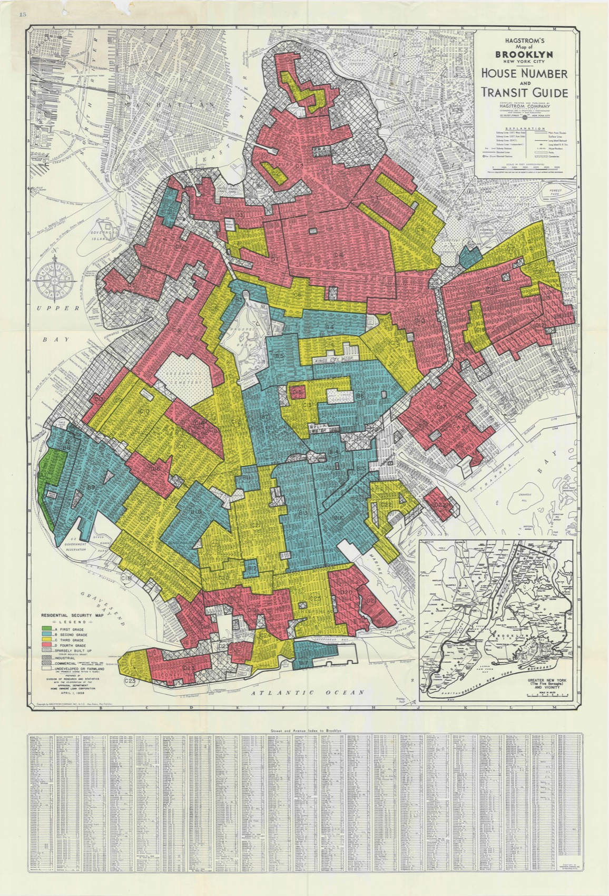

## Today's Agenda

:::: {.two-col}
::: {.concept-card}
[Session 1]{.label .concept}

[Lecture / demo]{.card-title}

- what counts as a GIS question
- three GIS paradigms for architecture
- the setup ladder: `Jupyter`, `Anaconda`, `Miniconda`, `Colab`
- `geopandas` as the code-GIS anchor
- Hong Kong data sources and pathway choice
:::

::: {.activity-card}
[Session 2]{.label .activity}

[Round table on YOUR site]{.card-title}

- upload one rough spatial material
- name the spatial claim it depends on
- reconstruct your layers in four steps
:::
::::

::: {.reflection-card}
A tool week is still an evidence week. We choose a GIS path only when the **decision** needs one — not because the maps look professional.
:::

---

[The framing]{.kicker}

## GIS is not just digital mapping

GIS earns a place in your workflow only when your question depends on:

- location
- proximity
- overlap
- boundaries
- access
- context over space and time

::: {.concept-card}
If the question is not spatial, a beautiful map is decoration, not evidence.
:::

---

[Read the site first]{.kicker}

## Stand-alone site prompt

{height="480"}

If this were your project, what spatial questions would matter **first**?

---

## Typical GIS questions for architecture

- which site is better connected to transit?
- which parcels fall inside a flood or noise risk zone?
- how much of a site lies within a 5-minute walking catchment?
- where do zoning, topography, and infrastructure collide?
- how can context be exported into a design workflow?

::: {.concept-card}
Each one names a **spatial claim** you would have to defend with evidence.
:::

---

[Three paths, one decision]{.kicker}

## Three GIS paradigms

| Path | Best for | Strength | Risk |
|---|---|---|---|
| `QGIS` | visual exploration and map production | free, flexible, fast to start | harder to reproduce step by step |
| `ArcGIS` | institutional and enterprise workflows | strong ecosystem, client compatibility | licensing, overhead, platform dependence |
| `geopandas` | notebook-based spatial analysis | reproducible, scriptable, integrates with Python | setup and debugging overhead |

---

## `QGIS`: the fast visual option

- ideal for loading many layers quickly
- good for buffers, clips, joins, styling, and export
- strong when you need to inspect data before deciding what matters
- often the easiest starting point for students new to GIS

---

## `ArcGIS`: the professional ecosystem option

- useful when offices, clients, or institutions already depend on it
- stronger for enterprise sharing, web maps, and standardized workflows
- relevant if students need to read the logic of professional practice
- not the default course anchor because the license and platform matter

---

## `geopandas`: the reproducible option

- sits inside `Jupyter Notebook`
- keeps spatial data close to `pandas`, plotting, and exported tables
- supports documented reruns and small pipeline automation
- makes code-driven GIS concrete rather than hypothetical

---

## Why `geopandas` sits at the center

::: {.concept-card}
The course needs **one** code-based GIS reference point students can see and reason through.
:::

That reference point is:

- `geopandas`
- in a notebook
- beside simple plotting and tabular analysis

---

[The setup ladder]{.kicker}

## From nothing to a running notebook

::: {.activity-card}
[Climb only as far as you need]{.card-title}

- `Anaconda` / `Miniconda` — local Python environment
- `Jupyter Notebook` — where code, outputs, and notes live together
- `geopandas` — the spatial analysis library
- `Google Colab` — fallback if local setup is not ready
:::

If local install stalls, start in `Colab` so the analysis is never blocked by the environment.

---

## Notebook anatomy

In a GIS notebook, you should be able to point to:

- imports
- file loading
- coordinate reference system (CRS) checks
- geometry operations
- quick plots or exports
- notes about what the output means

---

[Tool panel · capture comes later]{.kicker}

## A `geopandas` operation as a tool

::: {.tool-panel .demo-pending}
::: {.zone .input}
**Input** site polygon + a transit / amenity layer
:::
::: {.zone .operation}
**What varies** buffer distance (e.g. 200–600 m)
:::
::: {.zone .output}
**Output** coverage % per option (per site or per layer)
:::
::: {.zone .check}
**Quality check** CRS stated, feature counts spot-checked
:::
:::

The dashed frame means the live capture does not exist yet — we will drop a real cell in, not a faked screenshot.

---

## Minimal `geopandas` workflow

```python
import geopandas as gpd

sites = gpd.read_file("candidate_sites.geojson")
sites = sites.to_crs(3857)          # state the CRS explicitly
sites["buffer_400m"] = sites.buffer(400)
print(len(sites))                   # spot-check the count
sites.plot(column="score", legend=True)
```

The logic matters more than the syntax: **load → inspect → project → operate → visualize.**

---

## Core GIS operations to recognize

- **buffer** — what lies within a distance?
- **clip** — what lies inside a boundary?
- **spatial join** — what overlaps what?
- **dissolve** — what can be combined by rule?
- **overlay** — where do constraints and opportunities intersect?

---

[The honest test]{.kicker}

## Decorative map vs decision map

:::: {.two-col}
::: {.example-card}
[Decorative map]{.card-title}
Many layers, rich styling, looks professional — but no claim attached. If you removed it, the argument would not change.
:::

::: {.activity-card}
[Decision map]{.card-title}
States CRS, names the inputs, reports a number (coverage %, count, distance), and points to one decision it changes.
:::
::::

::: {.warning-card}
If the output does not inform a decision, it is just map decoration.
:::

---

[Anecdote · a map that drove decisions for decades]{.kicker}

## 1930s: redlining maps that shaped cities

::: {.vibe-case}
::: {.vibe-visual}

:::
::: {.vibe-panel}
::: {.example-card}
[What it did]{.card-title}
Home Owners' Loan Corporation maps graded neighborhoods A–D and colored the "hazardous" ones red. Lenders used them to deny mortgages — a spatial layer that steered investment and segregation for generations.
:::
::: {.warning-card}
[The lesson]{.card-title}
A map is a decision instrument, not decoration — and it carries the bias of whoever drew it and how they classified. Choose layers and categories knowing they will drive real action.
:::
:::
:::

---

## GIS outputs that actually help design

- simple site-comparison maps
- walkshed / transit-access maps
- zoning and restriction overlays
- exposure / proximity summaries
- exported site context for further design work

---

[Where to look first]{.kicker}

## Hong Kong data sources

- `DATA.GOV.HK`
- Planning Department datasets
- Transport Department data
- Hong Kong Observatory climate records
- site-specific base drawings, counts, and photographs

::: {.concept-card}
Learn where to look **before** you start modeling — the data you can get shapes the claim you can make.
:::

---

## Example workflow 1: site selection

**Question:** which of three candidate sites best balances transit access, development constraints, and environmental exposure?

::: {.example-card}
[Possible pathway]{.card-title}
- `QGIS` for first-pass layer exploration
- `geopandas` if repeated comparisons or automation become useful
:::

---

## Example workflow 2: public-space access

**Question:** how does a proposal change access within a 5-minute or 10-minute walk?

::: {.example-card}
[Possible pathway]{.card-title}
- GIS for network and catchment logic
- spreadsheet later for ranking alternatives
:::

Pathways can support each other even when one remains primary.

---

## Example workflow 3: context for studio modeling

**Question:** what context data should be brought into Rhino / Grasshopper or another design environment?

::: {.example-card}
[Possible pathway]{.card-title}
- use GIS to select, simplify, and export
- avoid importing the entire city when only a few layers matter
:::

---

[Practice]{.kicker}

## Tool choice drill

For each question, choose the first tool you would reach for:

1. "I need to inspect zoning, roads, and transit stops quickly."
2. "I need a client-facing web map tomorrow."
3. "I need to rerun the same buffer/join workflow across multiple sites."

Discuss in pairs, then justify the choice.

---

## Suggested answers

:::: {.two-col}
::: {.concept-card}
1. `QGIS`
2. often `ArcGIS`
3. `geopandas`
:::

::: {.reflection-card}
[The point]{.card-title}
No one tool wins everything. **Fit** to the decision is what matters.
:::
::::

---

## 15-minute GIS scoping sprint

::: {.activity-card}
[Choose your own project and write down]{.card-title}
- the spatial question
- the smallest useful spatial output
- the minimum input layers needed
- whether you would start in `QGIS`, `ArcGIS`, or `geopandas`
- what would make GIS the **wrong** pathway
:::

---

## When GIS is the right semester pathway

Choose GIS if your decision genuinely depends on:

- spatial comparison
- distance or travel logic
- boundaries and overlaps
- site or urban context evidence

::: {.warning-card}
Do not choose GIS because the maps look professional.
:::

---

## BREAK {.big-break}

Take 10 minutes.

When you return, post one rough spatial material to Slack for Session 2.

---

[Session 2 · Round table]{.kicker}

## Round table on YOUR site

::: {.spine-rail}
[Decision]{.node} [Evidence]{.node .is-current} [Variation]{.node} [Output]{.node} [Threshold]{.node} [Action]{.node}
:::

Upload one rough spatial material to Slack before Session 2 — site map, plan or context image, route diagram, or spatial layer sketch. [feeds A2]{.feeds-tag}

---

## Name the spatial claim

Speak for 60–90 seconds about your material:

::: {.concept-card}
[The Session 2 question]{.card-title}
**Does this decision depend on location, distance, overlap, boundary, or access?**
:::

If yes, it is a spatial claim GIS could help defend. If no, GIS is likely the wrong pathway — and saying so is a strong move.

---

## Reconstruct your site in four steps

**Object this week: your site's spatial layers and the spatial claim they support.**

::: {.recall-4step}
::: {.step}
**Did** Which layers did I gather, and what claim do they make?
:::
::: {.step}
**Assumed** What did I assume about CRS, coverage, or completeness?
:::
::: {.step}
**Risk** Where could the spatial claim break or mislead?
:::
::: {.step}
**Verify** What would I check — counts, CRS, a buffer recomputed?
:::
:::

::: {.grading-note}
Post your filled four-step to Slack under your material. Posting + an honest reconstruction is the graded unit — not how you spoke. Volunteers go first; random draw may fill the remaining examples.
:::

---

[Exit]{.kicker}

## Week 4 exit check

By the end of this week, you should know:

::: {.concept-card}
- whether GIS belongs in your short list
- whether you are more comfortable starting visually or in notebooks
- what role `geopandas` would play if you choose the GIS pathway
:::

Week 5 builds the Evidence + Workflow Map from the claim you named today.
