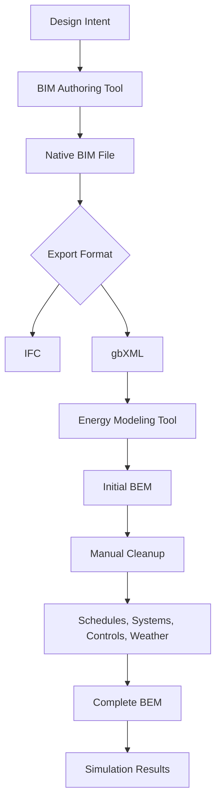

## Today's Agenda

- BIM and BEM are not the same model
- how BIM files become BEM files
- what gets lost in translation
- IFC vs `gbXML`
- debugging exercises and pathway commitment

---

## Session 2: Project Reasoning Round Table

Upload one rough material to Slack before Session 2:

- BIM/BEM screenshot
- section or envelope image
- model diagram
- performance claim from your project

Speak for 60-90 seconds:

**What would a performance model need to know, and what would it probably simplify?**

This feeds **A2: Tool Translation Matrix** and **A2: Workflow Feasibility**.

Volunteers go first; random draw may fill the remaining examples.

---

## Why This Week Matters

Even if your semester pathway is not simulation-heavy, you still need to understand:

- what performance claims are built from
- why some model outputs are more trustworthy than others
- where BIM/BEM workflows break in practice

---

## Stand-Alone Case Prompts

:::: {.columns}
::: {.column width="50%"}
{height="280"}

What kinds of evidence would support a claim about workplace performance here?
:::

::: {.column width="50%"}
{height="280"}

What kinds of evidence would support a claim about environmental performance here?
:::
::::

---

## 🏗️ What Are BIM and BEM?

**BIM**

- digital model of physical and functional building characteristics
- serves design, construction, coordination, and facility management
- prioritizes geometry, materials, relationships, and documentation

**BEM**

- computational model of thermal behavior and energy flows
- serves analysis, optimization, and compliance
- prioritizes zones, schedules, systems, weather, and performance assumptions

---

## Same Building, Different Core Questions

**BIM asks:**  
What do we build, where does it go, and how is it put together?

**BEM asks:**  
How will it behave over time when weather, people, and systems act on it?

---

## BIM Data Priorities

- project, site, building, levels
- spaces and rooms
- walls, windows, floors, roofs, doors
- material layers and product attributes
- element relationships and construction logic

---

## BEM Data Priorities

- thermal zones
- heat-transfer surfaces
- internal loads
- occupancy schedules
- HVAC systems and control logic
- weather and shading context

---

## Quick Check: BIM or BEM?

1. Exact window manufacturer and product code
2. Occupancy schedule by hour
3. Thermal resistance of an assembly
4. Construction sequencing
5. Cooling setpoint and operating hours

**Pair task:** label each item `BIM`, `BEM`, or `both`.

---

## Quick Check Answers

- exact manufacturer and product code: mostly `BIM`
- occupancy schedule by hour: `BEM`
- thermal resistance of an assembly: often `both`, but used differently
- construction sequencing: `BIM`
- cooling setpoint and operation hours: `BEM`

**Key insight:** the same wall can exist in both models, but not for the same reason.

---

## How BIM Files Get Made

- **manual BIM authoring** in Revit / ArchiCAD / similar
- **3D import** from Rhino, SketchUp, or other geometric models
- **point cloud capture** for as-built conditions and renovation work

Each path changes how much cleanup is needed before any energy analysis begins.

---

## How BEM Files Get Made

- translate from an existing BIM model
- build a direct energy model from drawings and assumptions
- start from a template or archetype and adapt it

All three approaches are common. None is frictionless.

---

## Workflow Map — Design to Analysis

---

## The Translation Gap

When BIM becomes BEM, problems usually come from four categories:

- geometry
- zoning
- constructions
- operations

---

## Geometry Issues

- curved facades oversimplified into straight planes
- tiny modeled objects exported as meaningful surfaces
- orientation or context errors
- missing adjacent buildings and shading

---

## Thermal Zoning Issues

- BIM spaces do not map neatly to thermal zones
- open offices become fragmented or over-zoned
- plenums, circulation zones, or mixed-use spaces disappear or split badly

---

## Construction and Material Gaps

- walls export as generic “exterior wall”
- layers, R-values, SHGC, and internal mass are incomplete
- thermal bridges and details are ignored

---

## Operational Data Missing

- no occupancy schedules
- no equipment or lighting schedules
- no setpoints or control strategies
- no HVAC system definitions

**This is why a clean-looking import can still be analytically useless.**

---

## 🎯 Translation Detective Challenge

**Scenario:** You exported a 5-story office building to `gbXML` and the first model run shows energy use at **3x** what you expected.

**In groups, identify likely causes:**

1. What probably happened to the thermal zones?
2. What is likely wrong with the HVAC assumptions?
3. What data probably failed to translate?
4. What would you inspect first before trusting any output?

---

## IFC vs `gbXML`

Both are bridges. Neither is a perfect bridge.

| Feature | IFC | `gbXML` |
|---|---|---|
| Primary purpose | broad BIM exchange | energy model translation |
| Geometry detail | high | moderate |
| Thermal zoning support | weak | better |
| File size / speed | heavier | lighter |
| Construction detail | stronger | narrower |

---

## What Each Bridge Is Good At

**IFC**

- archiving and coordination
- multi-disciplinary interoperability
- detailed building information

**`gbXML`**

- getting geometry and basic constructions into energy tools
- faster processing
- better starting point for thermal-zone workflows

---

## Why Neither Solves the Whole Problem

- manual cleanup is still required
- vendor implementations vary
- updates overwrite hand fixes
- building design logic and energy logic are not the same thing

---

## Ideal Workflow vs Real Workflow

**Ideal**

1. update BIM
2. export cleanly
3. update BEM automatically
4. rerun analysis
5. feed changes back into design

**Real**

1. export once
2. spend days cleaning the BEM
3. design changes continue
4. model diverges
5. everyone hopes the gap is still “small enough”

---

## Case Study: Translation Gone Wrong

- new 15,000 m² university research building
- BIM in Revit with MEP coordination
- energy model in OpenStudio / EnergyPlus
- goal: LEED Gold energy analysis

---

## Case Study Timeline

**Week 1**

- export appears successful
- team believes the workflow is seamless

**Week 2**

- 465 thermal zones created instead of about 30
- HVAC missing
- generic constructions everywhere
- orientation wrong

---

## Case Study Timeline (cont'd)

**Weeks 3-4**

- merge zones manually
- define constructions and material properties
- build schedules and HVAC systems
- fix context and shading

**Week 8**

- design changes arrive
- re-export means losing cleanup work
- manual updates begin and divergence starts

---

## Lessons Learned

- BIM was not authored with energy analysis in mind
- missing data only became obvious after export
- there was no workflow for iterative updates
- “the file opened” did not mean “the model is valid”

---

## 🎮 Divergence Detective

**Scenario:** Actual energy use is 30% higher than predicted because BIM and BEM drifted apart.

Investigate in groups:

- what geometry changes could explain the increase?
- what material substitutions matter?
- what system or control changes matter?
- what operation schedules may differ from assumptions?

Come back with your top three suspects.

---

## Shared Literacy Takeaways

- BIM and BEM must stay related, but they should not be confused
- simulation outputs are only as good as the assumptions and cleanup behind them
- translation loss is normal, not an edge case
- performance claims need method transparency, not just metrics

---

## Pathway Commitment Check

After this week, you should be able to say:

- whether your project needs only literacy in BIM/BEM
- whether simulation evidence will support your question
- whether your primary semester pathway is `spreadsheet`, `GIS`, `Python`, `GH`, `BIM/BEM`, or `AI-assisted`
