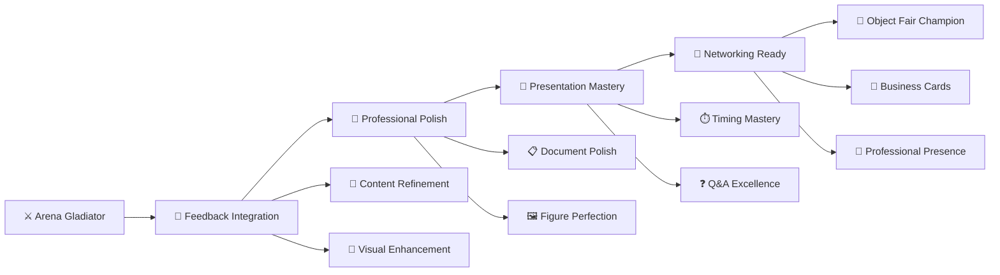

## 👑 Welcome to Championship Training Camp! {.center}

::: {.callout-important icon=false}
## Today's Mission: Transform from Gladiator to Champion

**The Goal**: Take your arena-tested presentation and polish it to championship perfection

**The Challenge**: Every detail must be flawless for Object Fair domination

**The Outcome**: Professional-grade presentation ready for industry experts
:::

**🏆 Today's Championship Events:**

⚡ **Feedback Integration Mastery** | 💎 **Professional Polish Lab** | 🎤 **Presentation Rehearsal Olympics** | 🤝 **Networking Preparation Academy** | 📋 **Final Submission Perfection**

---

## Session 2: Project Reasoning Round Table

Upload one rough material to Slack before Session 2:

- weakest A4 component
- final object card draft
- research brief section
- reproducibility capsule fragment

Speak for 60-90 seconds:

**Which A4 component is weakest, and what must be fixed before submission?**

This feeds **A4: Final Package**.

Volunteers go first; random draw may fill the remaining examples.

---

# Championship Training Overview {background-color="#2C1810"}

---

## 🎯 From Arena Survivor to Object Fair Champion

### 📊 Championship Transformation Plan



**🎪 Today's Format**: Intensive training camp with rotating skill stations and individual coaching

---

## 🏃 Championship Training Schedule

### ⏰ Training Camp Timeline

**Warm-Up** (15 minutes): Arena feedback integration and priority setting

**Training Block 1** (25 minutes): Professional polish laboratories  

**Training Block 2** (25 minutes): Presentation rehearsal olympics

**Training Block 3** (20 minutes): Networking preparation academy

**Cool-Down** (15 minutes): Final submission logistics and commitment ceremony

::: {.callout-tip}
## Champion Mindset

**Remember**: You survived the gladiator arena! Now we're transforming good presentations into industry-dominating championship performances.

**Key insight**: Championships are won in the details. Every small improvement compounds into unstoppable excellence.
:::

---

# Training Block 1: Professional Polish Laboratory {background-color="#1A472A"}

---

## 💎 The Professional Excellence Transformation

### 🔬 Polish Laboratory Stations

**🎨 Station A: Visual Perfection Lab** (8 minutes each)
- Figure design elevation to publication quality
- Object Card final refinement and print preparation  
- Color consistency and professional branding

**📝 Station B: Content Refinement Workshop** (8 minutes each)
- Writing clarity and professional tone perfection
- Citation accuracy and reference completion
- Component integration and consistency checking

**🎯 Station C: Message Clarity Clinic** (8 minutes each)
- Stakeholder relevance sharpening
- Key findings prominence and clarity
- Action items specificity and implementability

**💼 Station D: Professional Package Assembly** (8 minutes each)
- File format optimization and submission readiness
- Portfolio-quality material preparation
- Backup system and contingency planning

---

## 🎨 Visual Perfection Laboratory

### 🔥 Figure Transformation Challenge

**📊 Before/After Championship**:

**Bring your WORST figure** for emergency transformation into championship quality:

**⚡ 8-Minute Makeover Protocol**:
1. **Message Clarity** (2 min): Is the key insight obvious in 3 seconds?
2. **Professional Design** (3 min): Typography, color, layout refinement
3. **Stakeholder Focus** (2 min): Language and framing optimization
4. **Print/Display Test** (1 min): Readability at Object Fair scale

### 🏆 Champion Figure Checklist

- [ ] **3-Second Rule**: Key message immediately apparent
- [ ] **Professional Quality**: Suitable for industry publication
- [ ] **Stakeholder Language**: Accessible to non-experts
- [ ] **Object Fair Scale**: Readable from 6 feet away
- [ ] **Portfolio Ready**: Impressive enough for job applications

::: {.callout-success icon=false}
## Figure Hall of Fame

**Document champion transformations:**

**Most Dramatic Improvement**: _______________
*What changed*: _______________

**Most Professional Polish**: _______________
*Success factor*: _______________

**Best Stakeholder Communication**: _______________
*Key strategy*: _______________
:::

---

## 📝 Content Refinement Workshop

### ✨ Professional Writing Excellence

**🔍 Content Quality Assessment**:

**Championship Writing Standards**:
- **Clarity**: Every sentence serves the stakeholder message
- **Precision**: Technical accuracy with accessible language
- **Flow**: Logical progression from problem to solution
- **Action**: Clear next steps and implementation guidance

### ⚡ Rapid Content Enhancement

**8-Minute Writing Clinic**:

1. **Executive Summary Power** (2 min): Hook, findings, action in opening paragraph
2. **Stakeholder Thread** (2 min): Relevance clear throughout entire document
3. **Evidence Confidence** (2 min): Uncertainty appropriately communicated
4. **Professional Tone** (2 min): Industry-appropriate language and style

**🎯 Champion Writer Checklist**:
- [ ] Executive summary could stand alone as complete story
- [ ] Every section connects clearly to stakeholder needs  
- [ ] Evidence presented with appropriate confidence levels
- [ ] Recommendations specific enough to implement
- [ ] Writing error-free and professionally formatted

---

## 🎯 Message Clarity Clinic

### 🎪 The Ultimate Clarity Challenge

**⚡ 30-Second Stakeholder Test**:

**Partner up and role-play**: One person becomes busy stakeholder, other presents key message

**Stakeholder Instructions**: 
- Look at phone while "listening"
- Ask "So what should I actually DO?" after 30 seconds
- Rate clarity and action-orientation

### 💡 Message Sharpening Protocol

**🔧 Clarity Enhancement Steps**:

1. **Problem Definition** (2 min): Can stakeholder immediately understand why they care?
2. **Finding Translation** (2 min): Are technical results converted to business impact?
3. **Action Specification** (2 min): Are next steps concrete and implementable?
4. **Confidence Communication** (2 min): Is uncertainty level appropriate for decision-making?

::: {.callout-warning}
## Champion Reality Check

**Question**: If a stakeholder can only remember ONE thing from your presentation, what should it be?

**Your answer**: _______________

**Test**: Does every element of your presentation support this ONE key message?
:::

---

# Training Block 2: Presentation Rehearsal Olympics {background-color="#4A154B"}

---

## 🎤 Championship Presentation Mastery

### 🏆 Presentation Olympics Events

**Event 1: Speed Pitch Championship** (6 minutes)
- 90-second elevator pitch perfection
- Multiple stakeholder type adaptations
- Networking conversation mastery

**Event 2: Pressure Presentation** (10 minutes)  
- Full Object Fair presentation under pressure
- Live audience with challenging questions
- Professional composure and confidence

**Event 3: Q&A Combat Training** (6 minutes)
- Rapid-fire question response preparation
- Professional limitation acknowledgment  
- Confident redirection to key messages

**Event 4: Object Card Integration** (3 minutes)
- Visual aid integration and storytelling
- Physical space management and presence
- Professional poster presentation skills

---

## ⚡ Speed Pitch Championship

### 🥇 Elevator Pitch Olympics

**🎯 Challenge**: Master the 90-second pitch that opens doors

**🏃 Speed Dating Format**:
- **90 seconds**: Deliver pitch to "stakeholder" (rotating classmates)
- **30 seconds**: Receive specific improvement feedback
- **Rotate**: New stakeholder type, adapted pitch

**👥 Stakeholder Types for Practice**:
- 🏢 **Busy Developer**: Cares about ROI, timeline, risk
- 🏥 **Facility Manager**: Focuses on operational efficiency
- 🏛️ **Policy Maker**: Interested in scalable solutions
- 💰 **Investor**: Wants market opportunity and returns
- 👥 **Community Rep**: Values equity and local impact

### 🎪 Live Pitch Scoring

**Vote for championship categories**:

| Category | Winner | What Made Them Win |
|----------|--------|-------------------|
| **🎯 Most Compelling Hook** | ? | ? |
| **📊 Clearest Evidence** | ? | ? |
| **💼 Most Professional** | ? | ? |
| **🚀 Best Call to Action** | ? | ? |
| **🔥 Most Adaptable** | ? | ? |

---

## 🎭 Pressure Presentation Training

### 🔥 Championship Pressure Simulation

**⚔️ Full Combat Simulation**:

**Setup**: Complete Object Fair environment simulation
- Professional panel (instructor + 2 volunteers)
- Timer displayed (6-8 minutes)
- Q&A pressure with challenging questions
- Professional presentation expectations

**🎯 Performance Enhancement Focus**:
- **Confidence Under Pressure**: Maintain composure with difficult questions
- **Time Management**: Perfect pacing for maximum impact
- **Professional Presence**: Industry-appropriate demeanor and delivery
- **Message Mastery**: Key points delivered clearly despite pressure

### 📊 Championship Performance Metrics

**Live evaluation during practice**:

**🎤 Delivery Excellence**:
- Voice projection and clarity
- Professional posture and movement
- Eye contact and audience engagement
- Confident handling of technology

**📋 Content Mastery**:
- Clear message progression
- Evidence presented with conviction
- Stakeholder relevance obvious
- Professional limitation acknowledgment

**⚡ Pressure Response**:
- Composure under challenging questions
- Professional redirection techniques
- Confident uncertainty communication
- Gracious feedback reception

---

## ❓ Q&A Combat Advanced Training

### 🥊 Championship Q&A Mastery

**🔥 Likely Challenge Questions for Practice**:

**Category 1: Method Challenges**
- "How do you know your sample size is adequate?"
- "What about confounding factors you didn't consider?"
- "How generalizable are these findings?"

**Category 2: Implementation Reality**
- "What would this actually cost to implement?"
- "How long would it take to see results?"
- "Who would be responsible for making this happen?"

**Category 3: Alternative Explanations**
- "Couldn't these results be explained by [X] instead?"
- "What if your assumptions about [Y] are wrong?"
- "How does this compare to [competitor/alternative]?"

### 🎯 Champion Response Strategies

**The Professional Response Formula**:

1. **Acknowledge** (5 seconds): "That's an excellent question about..."
2. **Clarify** (10 seconds): "Based on my analysis, here's what I found..."
3. **Redirect** (10 seconds): "What this means for your decision is..."
4. **Next Steps** (5 seconds): "I'd be happy to follow up with more detail on..."

::: {.callout-tip}
## Champion Mindset for Q&A

**Remember**: Questions are opportunities to demonstrate expertise, not attacks to defend against.

**Key**: Confident acknowledgment of limitations builds credibility more than defensive responses.
:::

---

# Training Block 3: Networking Academy {background-color="#2E8B57"}

---

## 🤝 Professional Networking Championship Training

### 🎯 Object Fair Networking Strategy

**🏆 Networking Goals for Object Fair**:
- **Build Professional Relationships**: Connect with industry experts
- **Demonstrate Competence**: Show evidence-based design mastery
- **Create Opportunities**: Open doors for internships, jobs, collaborations
- **Learn Industry Insights**: Gain perspective on real-world applications

### 🎪 Networking Skills Olympics

**Event 1: Professional Introduction Mastery** (5 minutes)
- Confident handshake and eye contact
- Memorable personal branding
- Clear value proposition communication

**Event 2: Business Card Exchange Excellence** (5 minutes)
- Professional card design and presentation
- Follow-up strategy development
- Contact information management

**Event 3: Industry Conversation Navigation** (10 minutes)
- Professional small talk and relationship building
- Technical competence demonstration
- Career guidance and opportunity exploration

---

## 💼 Professional Introduction Championship

### 🎭 Introduction Formula Mastery

**🔥 The Champion Introduction Structure**:

**15 seconds**: "Hi, I'm [Name], I'm studying [Program] and I research [Area]"

**15 seconds**: "I just presented my work on [Key Finding/Impact]"

**10 seconds**: "I'd love to hear your perspective on [Relevant Industry Topic]"

### ⚡ Practice Championship Rounds

**Speed Networking Simulation**:
- **2 minutes per "industry professional"** (rotating classmates)
- Practice different introduction variations
- Receive feedback on professional presence
- Build confidence for real Object Fair networking

**🏆 Champion Categories**:
- **Most Professional**: Industry-appropriate presence and communication
- **Most Memorable**: Unique value proposition and personal branding
- **Best Industry Connection**: Most relevant conversation starters
- **Most Confident**: Natural and engaging interpersonal skills

---

## 📇 Business Card & Follow-Up Strategy

### 🎨 Professional Branding Lab

**⚡ 5-Minute Business Card Clinic**:

**Champion Business Card Elements**:
- **Clear Contact Information**: Name, email, phone, LinkedIn
- **Professional Title/Focus**: Evidence-based design researcher/architect
- **Key Differentiator**: What makes you unique and valuable
- **Follow-up Prompt**: Reason for continued conversation

### 📧 Professional Follow-Up Mastery

**🔥 Champion Follow-Up Email Template**:

```
Subject: Thank you for the insights on [specific topic] - [Your name]

Dear [Contact name],

Thank you for the valuable conversation about [specific detail from conversation]. Your point about [specific insight] particularly resonated with my research on [your topic].

I've attached my Object Fair presentation as you suggested, with special attention to [element they were interested in].

I'd welcome the opportunity to [specific next step based on conversation - informational interview, project collaboration, etc.] at your convenience.

Thank you again for your time and insights.

Best regards,
[Your name]
[Contact information]
```

::: {.callout-success}
## Networking Champion Success Metrics

**Quality over Quantity**: Better to have 3 meaningful conversations than 15 superficial exchanges

**Professional Goals**: 
- 2-3 industry contact exchanges
- 1-2 potential mentor relationships  
- 1 follow-up opportunity (informational interview, project discussion, etc.)
:::

---

# Final Submission Perfection & Logistics {background-color="#8B4513"}

---

## 📋 Championship Package Assembly

### 🏆 Complete A4 Package Excellence

**📁 Digital Submission Requirements**:

**Master Document Package**:
- [ ] **Complete A4 PDF**: All components integrated professionally
- [ ] **Individual Component Files**: Research Brief, Practice Case, Object Card, Reproducibility Capsule
- [ ] **Presentation Slides**: PowerPoint format, Object Fair ready
- [ ] **Self-Assessment Reflection**: 1 page professional development summary

**🎯 Quality Assurance Championship Checklist**:

**Content Excellence**:
- [ ] All findings consistent across components
- [ ] Stakeholder relevance clear throughout
- [ ] Professional writing and error-free presentation
- [ ] Evidence properly cited and referenced

**Visual Excellence**:
- [ ] All figures publication-quality and clear
- [ ] Object Card print-ready at display size
- [ ] Consistent professional design theme
- [ ] Portfolio-worthy presentation materials

---

## 🎪 Object Fair Day Championship Strategy

### 🏆 Day-of-Competition Excellence Plan

**🕒 Pre-Competition Preparation**:
- **90 minutes before**: Arrive early for technology testing
- **60 minutes before**: Object Card display setup and material organization
- **30 minutes before**: Mental preparation and networking with early arrivals
- **Competition time**: Professional presentation delivery

**⚔️ Competition Performance Strategy**:
- **Opening Energy**: Confident introduction and stakeholder relevance
- **Core Content**: Evidence presentation with professional conviction
- **Q&A Excellence**: Gracious question handling and expert responses
- **Closing Impact**: Clear action items and professional networking

**🎊 Post-Competition Excellence**:
- **Network Like a Champion**: Engage professionals with prepared conversation starters
- **Learn from Peers**: Study successful strategies from fellow competitors
- **Document Success**: Collect feedback and contact information for follow-up
- **Celebrate Achievement**: Acknowledge significant accomplishment and growth

---

## 🎯 Championship Commitment Ceremony

### 🏆 Final Preparation Pledge

::: {.callout-important icon=false}
## Week 11 Championship Checklist

**🥇 Gold Medal Preparation**:

**Competition Content**:
- [ ] **All Arena Feedback Integrated**: Every improvement implemented
- [ ] **Professional Polish Complete**: Publication-quality materials
- [ ] **Presentation Mastered**: Confident 6-8 minute delivery
- [ ] **Q&A Prepared**: Ready for challenging professional questions

**Professional Presence**:
- [ ] **Business Cards Ready**: Professional contact and branding
- [ ] **Networking Strategy**: Conversation starters and follow-up plan
- [ ] **Industry Presence**: Appropriate attire and professional demeanor
- [ ] **Champion Mindset**: Confident representation of evidence-based design

**Championship Mindset**:
- [ ] **Value Demonstration**: Ready to show professional competence
- [ ] **Learning Orientation**: Open to feedback and industry insights
- [ ] **Peer Support**: Committed to celebrating collective success
- [ ] **Professional Growth**: Viewing Object Fair as career investment

**Commitment Level Declaration**: Stand and announce your championship preparation level! 📣
:::

---

## 👑 Championship Mindset Final Training

### 🔥 Champion Psychology

::: {.callout-warning icon=false}
## The Champion's Creed

**All championship competitors stand and recite:**

*"I have transformed my research into professional excellence."*

*"I will represent evidence-based design with confidence and competence."*

*"I will network professionally and build relationships that advance the field."*

*"I will demonstrate not just what I learned, but who I have become as a professional."*

*"At Object Fair, I compete not just for myself, but for the advancement of evidence-based design."*

**Championship Commitment**: Embrace a fellow competitor and commit to mutual success! 🏆🤝
:::

### 🌟 Championship Visualization

**Close your eyes and visualize Object Fair success**:
- You deliver your presentation with confidence and professional presence
- Industry professionals engage with genuine interest in your work
- You handle questions with expertise and gracious competence
- You network effectively and create valuable professional relationships
- You feel proud of representing evidence-based design excellence

**Open your eyes as Object Fair champions!** 👑

---

**🎯 Object Fair Day Preview**: Championship competition and professional networking celebration

*"Champions are not born—they are forged through preparation, polished through practice, and proven through performance!"* ⭐

**Next week: Championship competition at Object Fair!** 🏆

---

*"You are ready. You are prepared. You are champions. Go dominate Object Fair!"* 👑
