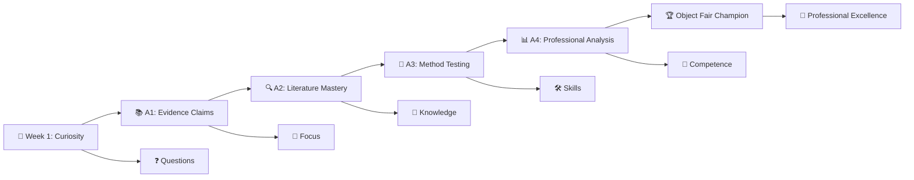

## 🏆 Welcome to the Object Fair Championship! {.center}

::: {.callout-important icon=false}
## The Grand Finale: Evidence-Based Design Excellence

**Today's Mission**: Celebrate your transformation from student to evidence-based design professional

**The Stage**: Industry professionals, peers, and faculty witnesses to your achievement

**The Legacy**: You represent the future of systematic, stakeholder-centered design
:::

**🎪 Today's Championship Events:**

🎖️ **Professional Presentation Championship** | 🤝 **Industry Networking Excellence** | 🌟 **Peer Celebration & Recognition** | 🚀 **Professional Development Launch**

---

## Session 2: Project Reasoning Round Table

Use your final object card or reflection note.

Speak for 60-90 seconds:

**What design reasoning can transfer to another studio project?**

This feeds **A4: Reflection Note**.

The purpose is synthesis, not a second formal presentation.

---

# Championship Opening Ceremony {background-color="#1A1A2E"}

---

## 🎺 Welcome to Excellence

### 🌟 The Journey from Week 1 to Champion

**🎯 What You've Achieved**: Transformation from curious students to evidence-based design professionals ready to change the built environment

---

## 🎪 Championship Format & Excellence Standards

### 🏆 Professional Competition Structure

**🕒 Championship Timeline**:
- **Setup & Final Preparation** (15 minutes)
- **Opening Ceremony** (10 minutes)  
- **Professional Presentation Championship** (90 minutes)
- **Industry Networking & Recognition** (25 minutes)

**👨‍⚖️ Championship Panel**:
- **Industry Professionals**: Real-world application experts
- **Academic Leaders**: Research methodology specialists
- **Practice Innovators**: Evidence-based design pioneers
- **Career Development Mentors**: Professional growth advisors

**🎯 Excellence Evaluation**:
- **Professional Competence**: Research quality and stakeholder relevance
- **Communication Mastery**: Presentation skills and industry engagement
- **Innovation Leadership**: Creative approaches and novel insights
- **Professional Readiness**: Career preparation and network development

---

# Professional Presentation Championship {background-color="#0F4C75"}

---

## ⚔️ Individual Championship Presentations

### 🏆 Championship Performance Standards

**🎤 Professional Presentation Excellence**:
- **6-8 minutes**: Core presentation demonstrating professional competence
- **4 minutes**: Q&A with industry panel showing expertise
- **Professional Standards**: Industry-appropriate communication and presence
- **Object Card Integration**: Visual aid supporting professional messaging

**🎯 Champion Qualities Being Evaluated**:

**Research Excellence**: 
- Systematic approach to design problems
- Evidence-based findings with appropriate confidence
- Stakeholder-centered analysis and recommendations

**Professional Communication**:
- Clear, compelling presentation to industry audience
- Confident response to challenging questions
- Effective visual design supporting key messages

**Industry Readiness**:
- Understanding of real-world application context
- Professional presence and networking capability
- Contribution to evidence-based design advancement

---

## 🎭 Championship Presentation Showcase

### 🌟 Individual Excellence Demonstrations

*During actual Object Fair, this section will document highlights from each presentation*

**🏆 Championship Presentations**:

**Presentation 1**: [Student Name]
- **Project Focus**: _______________
- **Key Innovation**: _______________
- **Industry Relevance**: _______________
- **Champion Quality**: _______________

**Presentation 2**: [Student Name]  
- **Project Focus**: _______________
- **Key Innovation**: _______________
- **Industry Relevance**: _______________
- **Champion Quality**: _______________

*[Continue for all presentations...]*

::: {.callout-success icon=false}
## Live Championship Recognition

**Outstanding Performance Awards**:

🥇 **Research Excellence Champion**: _______________
*Recognition for*: _______________

🎤 **Communication Master**: _______________  
*Recognition for*: _______________

💡 **Innovation Leader**: _______________
*Recognition for*: _______________

🤝 **Industry Impact Champion**: _______________
*Recognition for*: _______________

🌟 **Peer Choice Award**: _______________
*Recognition for*: _______________
:::

---

## 📊 Industry Panel Excellence Feedback

### 💼 Professional Perspective on Student Achievement

*This section will capture real-time feedback from industry professionals*

::: {.callout-note icon=false}
## Industry Professional Insights

**[Industry Professional Name]** - [Title & Organization]

**Overall Impression**: _______________

**Standout Presentations**: _______________

**Industry Application Potential**: _______________

**Career Readiness Assessment**: _______________

**Advice for Continued Development**: _______________

---

**[Academic Professional Name]** - [Title & Institution]

**Research Quality Assessment**: _______________

**Methodological Innovation Observed**: _______________

**Professional Communication Excellence**: _______________

**Recommendations for Academic/Research Pathways**: _______________
:::

---

# Industry Networking Excellence {background-color="#2E8B57"}

---

## 🤝 Professional Relationship Building Championship

### 🌟 Networking Excellence in Action

**🎯 Professional Networking Objectives**:
- **Demonstrate Competence**: Show evidence-based design mastery to industry
- **Build Relationships**: Create connections for career development
- **Learn Industry Insights**: Gain real-world perspective on applications
- **Represent Excellence**: Showcase program quality and student achievement

### 🏆 Networking Success Stories

*To be documented during actual networking sessions*

**🤝 Professional Connections Made**:

**Career Development Opportunities**:
- **Internship Discussions**: _______________
- **Job Opportunity Mentions**: _______________
- **Mentorship Offers**: _______________
- **Collaboration Proposals**: _______________

**Industry Learning Insights**:
- **Real-World Application Feedback**: _______________
- **Industry Challenge Identification**: _______________
- **Professional Development Guidance**: _______________
- **Market Opportunity Awareness**: _______________

---

## 💼 Professional Development Launch Platform

### 🚀 Career Advancement Strategy Session

**🎯 Immediate Professional Development Opportunities**:

**Industry Connections for Follow-Up**:
- **Mentor Relationship Development**: Scheduled informational interviews
- **Project Collaboration Exploration**: Research partnership discussions  
- **Career Guidance Conversations**: Professional development planning
- **Industry Network Expansion**: Professional organization introductions

**Academic and Research Pathways**:
- **Graduate Research Opportunities**: PhD program discussions
- **Publication and Conference Potential**: Academic contribution planning
- **Research Collaboration Networks**: Inter-institutional partnership development
- **Grant and Funding Guidance**: Research funding strategy discussions

### 📈 Professional Portfolio Enhancement

**🏆 Object Fair Achievement Integration**:
- **Portfolio Documentation**: Professional presentation materials and feedback
- **LinkedIn Profile Enhancement**: Professional competence demonstration
- **Resume Development**: Evidence-based design skills and accomplishments  
- **Reference Network Building**: Professional endorsements and recommendations

---

# Peer Recognition & Celebration {background-color="#8B0000"}

---

## 🎊 Collective Achievement Celebration

### 🌟 Peer Excellence Recognition

**🏆 Peer Choice Awards** (Class Voting):

**🎯 Most Inspiring Research**: Whose work made you most excited about evidence-based design?

**🤝 Most Collaborative**: Who most helped others achieve excellence?

**💡 Most Creative Approach**: Who found the most innovative solution to their challenge?

**📊 Best Technical Execution**: Who demonstrated the highest research quality?

**🎤 Most Professional Presentation**: Who set the standard for communication excellence?

**🚀 Most Industry-Ready**: Who seems most prepared for professional practice?

### 🎭 Individual Growth Recognition

**🌱 Transformation Stories**:

*Students share brief reflections on their learning journey*

**"Biggest Learning Surprise"**: What unexpected insight changed your approach?

**"Proudest Achievement"**: What accomplishment means most to you?

**"Future Application"**: How will you use these skills in your career?

**"Advice for Future Students"**: What wisdom would you share?

---

## 📚 Collective Learning Integration

### 🔍 Course Impact Assessment

**🎯 Skills Development Achieved Across Class**:

**Research Capabilities**:
- **Problem Framing Excellence**: Systematic approach to design challenges
- **Evidence Evaluation Mastery**: Critical assessment of information quality
- **Method Design Innovation**: Creative approaches to systematic investigation
- **Data Analysis Competence**: Professional-quality analysis and visualization

**Professional Competencies**:
- **Stakeholder Communication**: Audience-appropriate presentation and engagement
- **Project Management Excellence**: Systematic planning and adaptive execution
- **Peer Collaboration Mastery**: Professional teamwork and mutual support
- **Industry Readiness**: Professional presence and networking capability

### 🌍 Evidence-Based Design Impact

**🏆 Collective Contribution to the Field**:

**Knowledge Generation**: Original research contributing to evidence-based design
**Method Innovation**: New approaches to systematic design investigation  
**Professional Network**: Industry connections advancing evidence-based practice
**Academic Excellence**: Research quality suitable for publication and application

**🎯 Program Representation**: Outstanding demonstration of evidence-based design education quality

---

# Professional Development Launch {background-color="#4B0082"}

---

## 🚀 Beyond Object Fair: Professional Excellence Continuation

### 🎯 Immediate Next Steps for Champions

**📧 Professional Follow-Up Excellence**:
- **Industry Contact Communication**: Professional follow-up with networking connections
- **Mentor Relationship Development**: Scheduling informational interviews and guidance sessions
- **Collaboration Opportunity Exploration**: Research partnerships and project discussions
- **Professional Organization Engagement**: Membership and involvement in evidence-based design networks

**📁 Portfolio and Professional Presence Enhancement**:
- **LinkedIn Profile Optimization**: Evidence-based design competence demonstration
- **Portfolio Development**: Object Fair materials integration and presentation quality
- **Resume Enhancement**: Skills and accomplishments professional documentation
- **Reference Network Building**: Professional endorsements and recommendation development

---

## 🌟 Long-Term Professional Development Strategy

### 🏆 Career Excellence Pathway

**🎓 Academic and Research Advancement**:
- **Graduate Study Preparation**: PhD programs and research opportunities
- **Publication and Conference Development**: Academic contribution and professional recognition
- **Research Network Expansion**: Collaboration and partnership building
- **Grant and Funding Pursuit**: Research support and project development

**💼 Industry Leadership Development**:
- **Evidence-Based Design Practice Integration**: Professional application and innovation
- **Client Communication Excellence**: Stakeholder engagement and project success
- **Industry Thought Leadership**: Conference speaking and professional publication
- **Mentorship and Knowledge Sharing**: Supporting future evidence-based design professionals

### 🔮 Future Impact Vision

**🌍 Contribution to Built Environment Excellence**:
- **Practice Innovation**: Evidence-based approaches in professional work
- **Industry Standards Development**: Contributing to professional practice evolution
- **Education and Training**: Sharing knowledge with future professionals
- **Policy and Regulation Influence**: Evidence-based approaches to building standards

---

# Championship Closing Ceremony {background-color="#DAA520"}

---

## 🏆 Champion Recognition and Legacy

### 🎖️ Official Achievement Recognition

::: {.callout-success icon=false}
## ARCH7476 Evidence-Based Generative Design Champions

**🌟 Class Achievement**: Outstanding demonstration of evidence-based design competence

**🎯 Individual Excellence**: Professional-quality research and presentation achievement

**🤝 Peer Collaboration**: Mutual support and collective learning excellence

**💼 Industry Readiness**: Professional presence and networking success

**🚀 Future Leadership**: Prepared to advance evidence-based design practice

**Certification**: Each champion has demonstrated competence in:
- Systematic design research methodology
- Evidence evaluation and critical analysis  
- Professional stakeholder communication
- Industry-appropriate presentation and networking
- Collaborative professional development
:::

---

## 🌟 Legacy and Continuing Impact

### 📚 Knowledge Contribution

**🔍 Research Contribution to Evidence-Based Design**:
- **Original Investigation**: Unique research questions and systematic analysis
- **Method Innovation**: Creative approaches to design investigation
- **Industry Application**: Real-world relevance and implementation potential
- **Academic Quality**: Research suitable for publication and professional application

**🎓 Educational Excellence Demonstration**:
- **Program Quality**: Outstanding representation of evidence-based design education
- **Professional Preparation**: Industry-ready competence and communication
- **Peer Learning**: Collaborative excellence and mutual support
- **Future Leadership**: Prepared to advance the field through professional practice

### 🚀 Professional Network Launch

**🤝 Industry Connection Success**:
- **Professional Relationships**: Meaningful connections with industry leaders
- **Career Development**: Mentorship and opportunity identification
- **Collaboration Potential**: Research partnerships and project opportunities
- **Network Expansion**: Professional organization engagement and leadership

---

## 🎊 Celebration of Excellence

### 👑 Champion Achievement Celebration

**🏆 Individual Achievement Recognition**: Each student has transformed from curious learner to evidence-based design professional

**🤝 Collective Success Celebration**: Outstanding peer collaboration and mutual support throughout the semester

**💼 Professional Readiness**: Demonstrated competence for industry engagement and career advancement

**🌟 Future Impact Potential**: Prepared to lead evidence-based design practice innovation and education

### 🎯 Final Champion Commitment

::: {.callout-warning icon=false}
## The Evidence-Based Design Professional Pledge

**All champions stand for final commitment:**

*"As evidence-based design professionals, we commit to:"*

*"Systematic investigation of design problems and stakeholder-centered solutions."*

*"Professional communication of findings with appropriate confidence and humility."*

*"Collaborative advancement of evidence-based design practice and education."*

*"Mentorship and knowledge sharing with future professionals in our field."*

*"Ethical application of evidence-based approaches to improve the built environment."*

**Congratulations, Evidence-Based Design Champions!** 🏆👑
:::

---

## 🌈 Thank You and Continued Excellence

### 🎓 Course Completion and Appreciation

**👨‍🏫 Instructor Appreciation**: Thank you for your dedication, curiosity, and professional excellence throughout this semester

**🤝 Peer Recognition**: Thank you for supporting each other's learning and celebrating collective achievement

**💼 Industry Professional Gratitude**: Thank you to our critics and mentors for sharing expertise and advancing student development

**🏆 Champion Achievement**: You have exceeded expectations and represented evidence-based design excellence

### 🚀 Continuing Professional Development

**📧 Ongoing Connection**: Course instructor available for continued professional development support

**🌐 Resource Access**: Course materials and resources remain available for professional reference

**🤝 Professional Network**: Peer connections for collaboration and mutual career support

**🎯 Future Opportunities**: Advanced coursework, research collaboration, and professional development pathways

---

**🎊 Congratulations on completing ARCH7476: Evidence-Based Generative Design with championship excellence!**

*Please join us for networking, celebration, and continued professional relationship building*

---

**🏆 You are now Evidence-Based Design Champions. Go forth and transform the built environment with systematic excellence!** 👑

**🌟 The future of evidence-based design is in your capable, professional hands.** ⭐

---

*Thank you for your excellence, your collaboration, and your commitment to advancing evidence-based design practice and education!* 🙏
